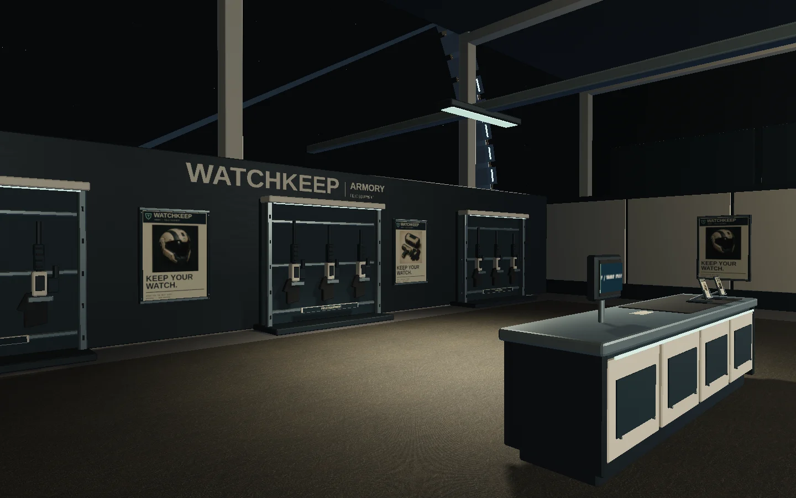
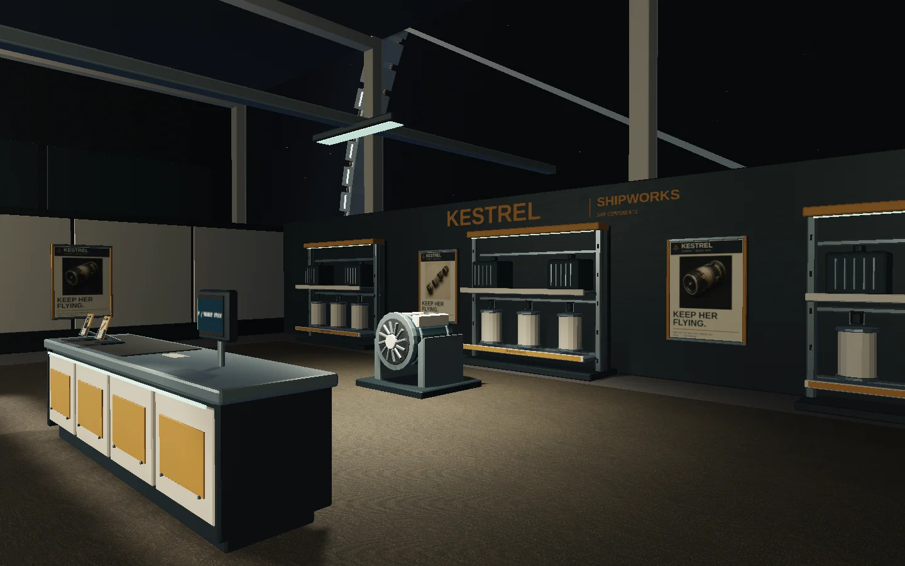
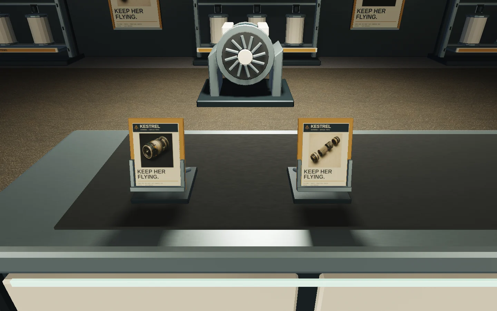
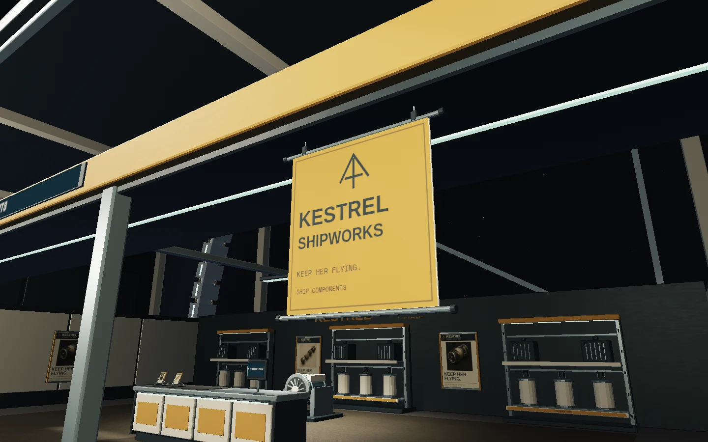

# Shop identity and retail dressing production record

## Brief and baseline

Cees asked for shop themes, branding, colour, posters, textures, banners, A5
folder stands and dirty carpet: interiors with a sense of everyday use. Preserve
the pressure elevator he praised, working purchases, circulation and the recent
CPU improvements. Baseline is `abacfdc` on `feat/station-concourse`; PR 20 remains
open against `feat/visual-fidelity`, with remote head `feat/hangar-finish`.

The prior actual-game armory/components frames are retained in
`station-shop-branding/*-before.webp`. They were captured at the prior runtime
`9e5a713`; the subsequent baseline commits changed documentation only.

## Ownership and production

- Root: original generated artwork/textile, source provenance, resource loading,
  interaction labels, game evidence and integration.
- Props agent: Blender concourse fixtures, anchor contracts, measured geometry
  and collision checks; elevator excluded from rebuild.
- Graphics agent: print typography/atlas, banner and carpet surfaces, batching.
- Shop agent: corresponding catalogue branding and token-based desktop/mobile
  menu styling; transaction and controller behavior preserved.

WATCHKEEP ARMORY is a petrol/ivory/mint security supplier. KESTREL SHIPWORKS is an
ochre/paper industrial parts supplier. Names are original; colours and fonts use
existing station tokens. Generic armory/components directions remain legible.

Two original images were generated through the built-in image tool. The four
campaign quadrants depict a security helmet, duty kit, ship drive and exploded
filter. Exact prompts, unmodified masters, derivative commands and provenance
are retained in [assets/station-shop](../../assets/station-shop/README.md).
The second image is worn charcoal low-pile carpet albedo. It is not used to infer
physical bump or roughness. All runtime image derivatives are 1024² WebP.

Baseline elevator SHA256, to preserve through the concourse-only rebuild:
`981a229de511ed34ea99a1d35cc639bb05651e4f8c8829d8ba987dbfc5b9f5c2`.

The Blender pass adds six folded-channel poster frames, two suspended banner
assemblies and four metal A5 pockets with physical paper stacks. KESTREL's fascia,
counter insets and rack headers use the existing ochre finish; its dark cabinets
contrast WATCHKEEP's petrol. The aggregate concourse is 3,247,564 bytes, 44,668
triangles and eight material draws, with 75 explicit collision boxes across 25
measured assemblies. The largest assembly remains 4,152 triangles / 319,984 bytes.
The two additional shared finishes are ochre paint and nonmetallic paper/cloth.
The elevator hash is unchanged. Exact anchor dimensions, orientations and bounds
are recorded in [the asset contract](station-concourse-assets.md).

The A5 faces are .148 × .210 m, tilted back 18°. The lowest banner rail is
1.982 m above the floor, clearing the current walking body by 82 mm. Actual
triangle sweeps and print backing/corner rays validate these physical details.

During integration, the entry view showed that the front fascia sits above the
camera at the counter. Rear-wall tenant marks were added to preserve identity
from inside. Code inspection also found a stretched illustration crop and a care
note partly beyond its counter support; both were returned for correction before
the first game capture.

## Validation and review status

Initial integrated `npm test`: 175 tests passed, zero failed (23 test files).
The final suite, including the three new graphics contracts, passes 178 tests
across 24 files. These cover the actual GLB print placements, A5 dimensions and
normals under a moved/rotated parent, native shared materials and flush carpets.

The production build passes with the existing large-chunk/outside-output-directory
notices. Final runtime bundle `index-Dy1CQeYC.js`, SHA256
`74cffbc24a8dcb4840d6e063666731750d918281e6744c24e0959ba1676e79fd`.
Concourse GLB SHA256
`c7ac88c867564caed225aeb708a374f331e8c479fdb6eeb4099fa2ab52d88878`.

Four Chromium production checks passed: shared cabin/material invariants, retail
resource budgets with both generated image requests deliberately failed, the
physical hangar→hub→controller purchase→cargo transfer→reload journey, and the
390×844 touch purchase/scroll/close journey. Optional image failure preserves
authored text graphics and a woven charcoal fallback without disabling station
finishing. The texture-failure case intentionally aborts network requests; normal
game captures have no console errors or warnings.

First game capture: twelve actual-renderer views, zero errors/warnings. Inspection
caught squashed shelf lettering; category strips moved to proportion-matched
tiles in a second 1024² sheet, retaining three graphics batches. Final capture:
fourteen views, including explicit views of both banners, zero errors/warnings.
Camera fixtures and raw evidence are in `/tmp/star-agent-shop-branding-final`.
All views use Chromium 151.0.7922.173, AMD Radeon 860M, ANGLE OpenGL ES 3.2,
1440×900 at render scale 1. They are controlled actual-game cameras; the separate
shop journey is the physical walking evidence.

First Chromium launch inside the restricted sandbox failed before navigation
with `setsockopt: Operation not permitted`; host-GPU execution succeeded. Later,
old unbranded UI screenshots overwrote the shared historical `/tmp` paths. The
new browser assertions had passed the exact new brand names, so those later
images were rejected as evidence. Shop screenshots now use Playwright's per-test
output paths with a dedicated run directory to prevent cross-worktree collisions.
Both shop journeys then passed again in 53.6 seconds against the final build;
the three isolated menu images visibly show WATCHKEEP and KESTREL and replace
the rejected copies in the curated set.

Retail graphics contribute 604 triangles in three batches: paper/cloth, painted
wordmarks/category strips and two flush carpets. Four shared GPU textures are
bounded at 1024²: two canvas sheets, carpet albedo and an independent 128² weave.
No new lights, shader replacements, per-bay texture copies or shadow cards were
added. The first timing run was anomalously slow even in the unchanged hangar;
an alternating graphics-on/off test investigates the new material cost separately
from background load. See [the performance record](station-shop-branding-performance.md).

Independent visual review and PR publication remain pending at this point in
the record; functional checks alone are not visual acceptance.

## Reproduction and retained images

```sh
npm test
npm run build -- --outDir /tmp/star-agent-concourse-build
node scripts/concourse-review.mjs --url http://127.0.0.1:5260 --out /tmp/star-agent-shop-branding-final
STATION_REVIEW_URL=http://127.0.0.1:5260 STATION_HARDWARE=1 npm run test:browser -- -c scripts/concourse.config.js scripts/station-shop.spec.js scripts/station-concourse.spec.js --output=/tmp/star-agent-shop-branding-ui-tests
```

The local preview remains http://127.0.0.1:5260/ . Enter the passenger elevator,
select Central hub, walk to either counter and press F. Purchases still arrive
in station storage. Combat, equipping and component installation remain outside
the implemented gameplay. Poster illustrations and static care notes are retail
dressing; A5 holders are decorative paper fixtures.

Curated actual-game images in `station-shop-branding/` use WebP quality 86 at
their original resolution. Before images retain the original baseline. No
generated concept image is presented as a game screenshot.





