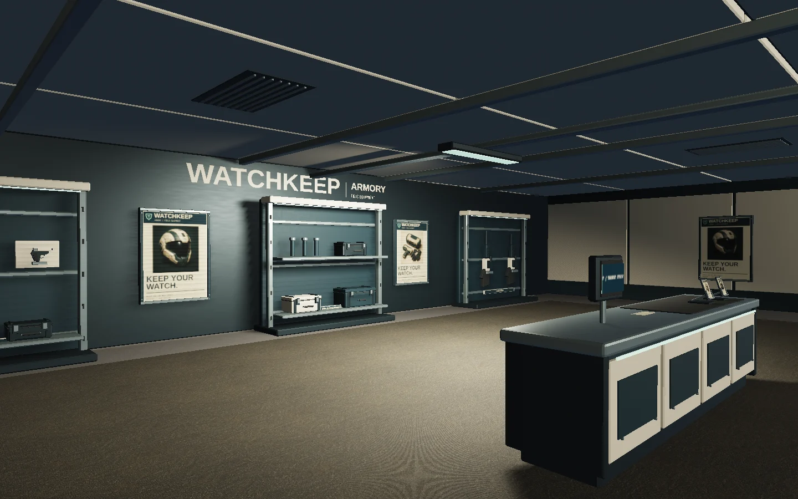
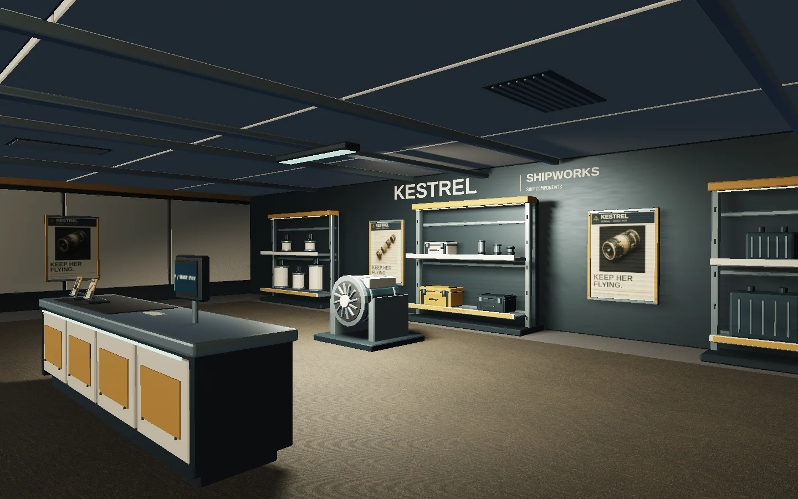
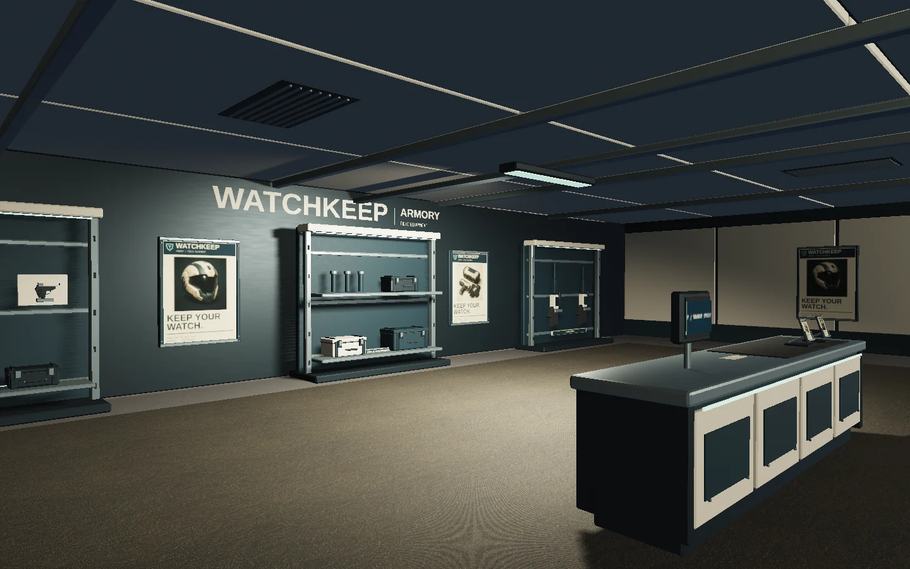
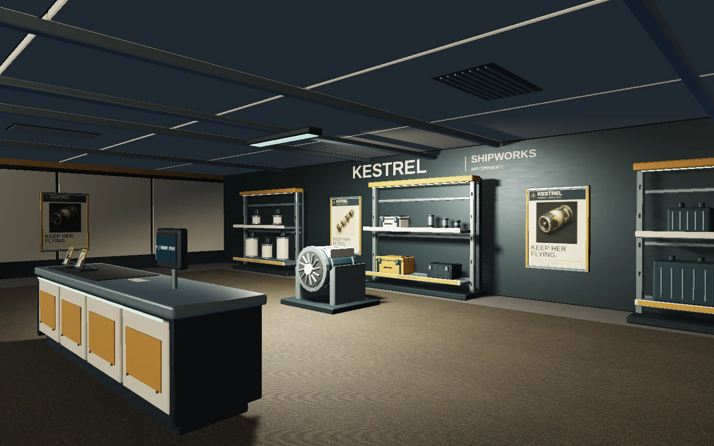

# Shop enclosure correction — 2026-09-06

**Final result: candidate025e587 passes Astra’s affected-shop visual rubric at4.00/5. The broader PR remains unapproved for merge.** See the [independent final review](station-shop-enclosure-astra-review.md). Earlier failures below are retained as the production history.

Runtime candidate **29885c9**, following the [independent Astra review](station-shop-branding-astra-review.md) of 435f116. The user explicitly chose Astra instead of Opus; the numerical quality threshold remains unchanged. This record supplements the [complete branding proceedings](station-shop-branding-record.md), including original image-generation prompts and source provenance.

The first review scored 3.50 and rejected acceptance. Its affected-shop findings were an upper room that looked open to space, underlit rear branding/stock and overly repeated merchandise. Those findings led to actual low ceiling cassettes, beams, vents and sealed perimeter downstands; varied long arms, sidearms, handled cases, filters, avionics and repair hardware; matching shelf categories; and brighter rear lettering within the existing palette.

The physical fixtures and the two existing shadowed shop lights now sit below the new ceiling. The first corrective render aimed 360 cd lights toward the rear centre and produced an excessive central hotspot with dark counters. A second actual-game render moved them to X±15, aimed at X±16.2/Y−8 and used 280 cd, a 1.45 rad cone and 0.3 penumbra. It balances the counter, carpet and rear displays without adding shadow maps. Root inspected the entry/interior views for both shops, the armory brochures and the Kestrel banner. Independent follow-up remains separately recorded.

## Exact assets and environment

- Concourse GLB: 3,801,048 bytes, 51,888 triangles, 8 material draws, 77 static collision boxes. SHA256 `953054d5cf34e246b4a0e3b43c5181d3e64e5ff5c4cbb18c44fa53e064975378`.
- Each new roof module: 2,068 triangles, approximately 182 KB, no new materials. See the [asset contract](station-concourse-assets.md) for dimensions, item counts and assembly budgets.
- Elevator GLB remains byte-identical, SHA256 `981a229de511ed34ea99a1d35cc639bb05651e4f8c8829d8ba987dbfc5b9f5c2`.
- Served production bundle `/assets/index-BJaVs6Cv.js`, SHA256 `e0a95c936d4c421e3deee8e51b1fa506255de0f9931c984398048c58b8267c49` at http://127.0.0.1:5260/ .
- Actual captures: AMD Radeon 860M, ANGLE OpenGL ES 3.2, 1440×900, render scale 1. All 14 views completed with zero browser errors or warnings. Capture evidence is `/tmp/star-agent-shop-enclosure-balanced/evidence.json`.
- `npm test`: all 24 test files passed. Eight focused actual-GLB tests include ceiling coverage/gap rays, walkable crosswalk/headroom, visible sidearms, full print transforms/backing clearances and unchanged elevator geometry.
- Production build passed; Vite retained its existing large-chunk and external-output-directory notices.

## Reproduction

```sh
npm test
npm run build -- --outDir /tmp/star-agent-concourse-build
node scripts/concourse-review.mjs --url http://127.0.0.1:5260 --out /tmp/star-agent-shop-enclosure-balanced
```

Curated images below are actual game captures, encoded as WebP quality 86 at their original resolution. Earlier branding images remain intact as historical before evidence. Review copies at `/review/shops/` on the local preview now show this correction. Static displayed goods and paper are decorative; real purchases retain the existing inventory/modal behavior and do not implement combat or ship installation.




## Validation receipt at 29885c9

Three production browser cases passed in 17.9 seconds: cabin resource bounds, both missing artwork requests with a usable fallback, and 390×844 touch purchase/close. The full-scale physical journey recording and independent Astra follow-up are in progress. Final canonical performance measured hub 269 draws / 479,478 triangles, GPU 4.934 ms median/5.286 ms p95, CPU 5.05/5.5 ms; hangar 505/684,953, GPU 8.387/8.626 ms, CPU 5.7/7.0 ms. Both had 16.7 ms RAF median and zero browser errors/warnings. Exact environment, methodology, prior slower results and evidence hashes remain in the [performance record](station-shop-branding-performance.md). No new acceptance score or whole-PR merge approval is claimed by this entry. Inherited world-view and performance findings remain separate from the shop correction.


## Shadow correction after Astra’s own captures

Astra’s independent 29885c9 images confirmed the original three corrections but
identified horizontal shadow banding on campaign posters and small mounting
tiles. Root had missed this at the first inspection. The failed intermediate
review and its original images remain in the [Astra follow-up](station-shop-enclosure-astra-review.md).

The first adjustment (depth bias −0.001, normal bias 0.08) cleared poster bands
but exposed coarse rack-shadow edges at 512². The final adjustment retains depth
bias −0.001, uses normal bias 0.04 and raises only the existing two shop shadow
maps to 1024². It adds no light or draw batch. Actual 14-view captures completed
with zero browser errors/warnings; root inspected both full-size interiors and
confirmed clean poster faces and improved rack shadows. The earlier maps remain
historical evidence under `/tmp/star-agent-shop-shadow-correction`; final root
captures are `/tmp/star-agent-shop-shadow-resolution`.

Final runtime **025e587**, served bundle `index-mk6QIuGf.js`, SHA256
`bde5924fa0c3bacbe03f03a87ea2946e0ff4583c207fa50a7c81f8b27dcec0e7`.
The GLB, shop logic, UI, collision and elevator are unchanged from 29885c9.
The build and all 24 unit-test files pass. The full-scale recorded desktop
journey passed on 29885c9 (48.6 seconds; 54.9 seconds total), prior to the shadow-only
change. See the [motion record](station-shop-motion.md) for source video,
consecutive-frame observations and camera/framing limitations; it is not a
recording of 025e587’s shadows.

The final local `/review/shops/` copies now show 025e587. Earlier enclosure images
above deliberately retain 29885c9; the following images show the correction.





Corrected mobile evidence: [top of catalogue](station-shop-enclosure/shop-mobile-top.webp)
and [scrolled purchase state](station-shop-enclosure/shop-mobile.webp),390×844
native DOM with the fixture’s 0.55-scale 3D background. Root inspected the top
image; it keeps the brand, wallet, delivery destination and persistent close
control readable. This is the controlled phone fixture, not a physically walked
touch transit journey.


## Independent disposition and handoff

Astra independently verified the final served bundle, captured/read all14 final
views and read the bounded motion sheets, two full-size purchase frames and
source metadata. Its final affected-shop rubric is **4 / 4 / 4 / 4 / 4 / 4 =4.00**,
with no item below3. The shop correction passes the unchanged numerical bar.
The user’s explicit choice of Astra replaces reviewer selection for this task,
not the threshold.

Whole-PR merge approval remains NO: inherited orbit draw budget, coast-vista
quality and CPU timing tails remain separate acceptance concerns. Minor followups
are fine rack-shadow stepping and a brief first-open heading font change in the
recorded modal. Motion4 applies to the bounded unchanged interaction; it does not
certify complete frontal door motion, every rendered frame or final-shadow motion.
No broader integration branch was changed or merged as part of this retail pass.

The pipeline memory and asset standard now retain the ceiling/fixture contract,
print transforms, varied stock, shadow diagnosis, isolated output naming and
motion provenance lessons. Portable recording/extraction helpers are checked in;
large source recordings and raw traces remain temporary artifacts identified by
hash, with that retention limitation made explicit. The manager receives the
receipt through appended HANDOFF entries in the isolated and shared workspaces.
