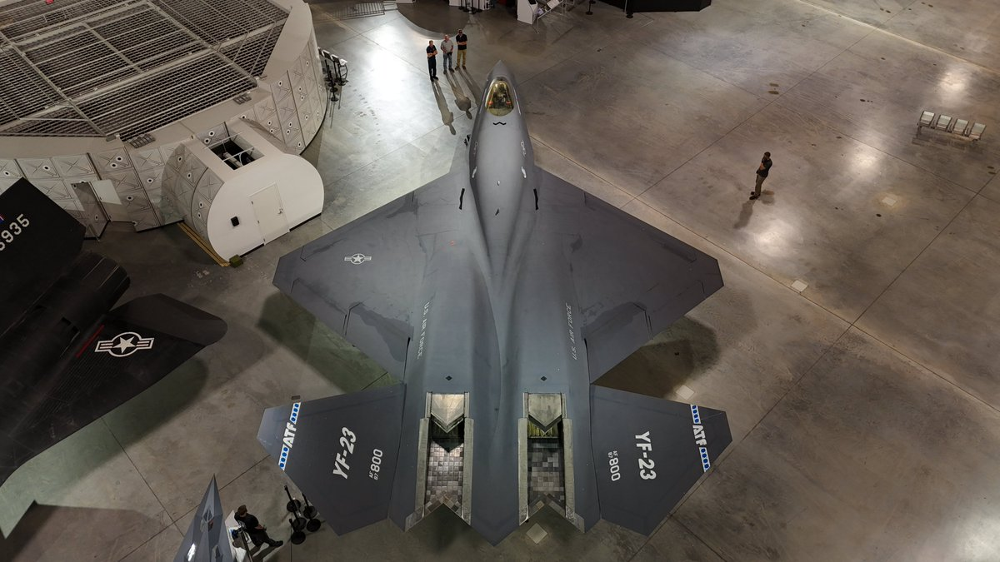

# Kestrel reference study

Original design, not a replica. Study proportions before any surface decoration.

Image above: National Museum of the USAF, [official museum post](https://x.com/AFmuseum/status/1924121764369428508), US Air Force photograph. Reference-only documentation; not a game texture or mesh source.

- [Aegis Gladius, official ship page](https://robertsspaceindustries.com/en/pledge/ships/gladius/Gladius): narrow single-seat forebody, purposeful exposed drive machinery.
- [Anvil Arrow, official Q&A](https://robertsspaceindustries.com/en/comm-link/engineering/16883-Q-A-Anvil-Arrow): thin swept wings and a compact fighter scale.
- [YF-23, National Museum of the USAF](https://www.nationalmuseum.af.mil/Visit/Museum-Exhibits/Fact-Sheets/Display/Article/195766/northrop-mcdonnell-douglas-yf-23a-black-widow-ii/): continuous chines, shoulders flowing into a lifting body, canted fins.
- [F-35, Lockheed Martin media kit](https://www.lockheedmartin.com/f35/mediakit.html): low canopy, intake lips, restrained panel hierarchy.
- Local faction reference: `docs/images/nomad-exterior.png` and `docs/images/nomad-cockpit.png`.

The Kestrel uses a longer nose, twin drive throats, fixed wingtip fins, white ceramic over graphite structure and mint service lights. It has no cargo room or standing cabin.

Studio illumination: [Studio Small 09](https://polyhaven.com/a/studio_small_09), Sergej Majboroda / Poly Haven, CC0. `assets/kestrel/studio-small-09.hdr` is the 1K source, used for authoring only.
