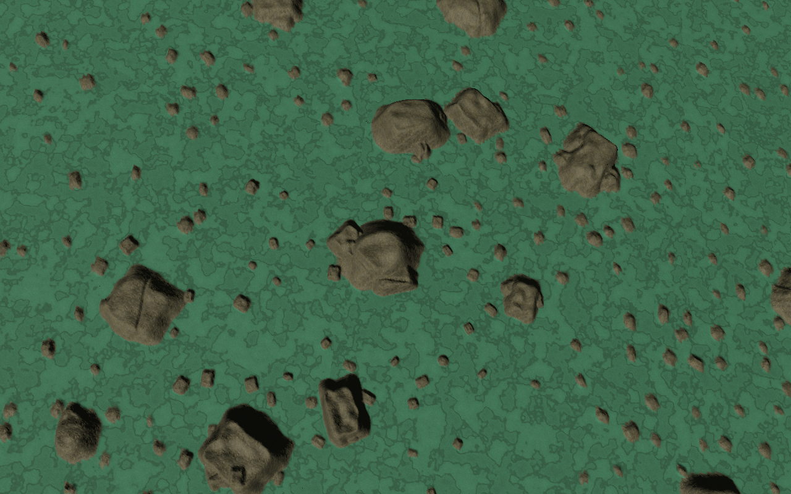
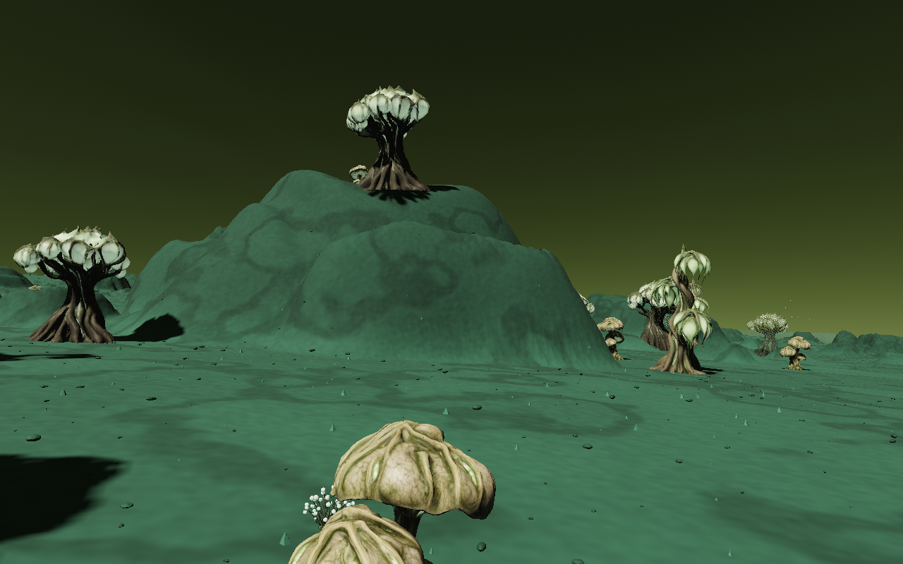
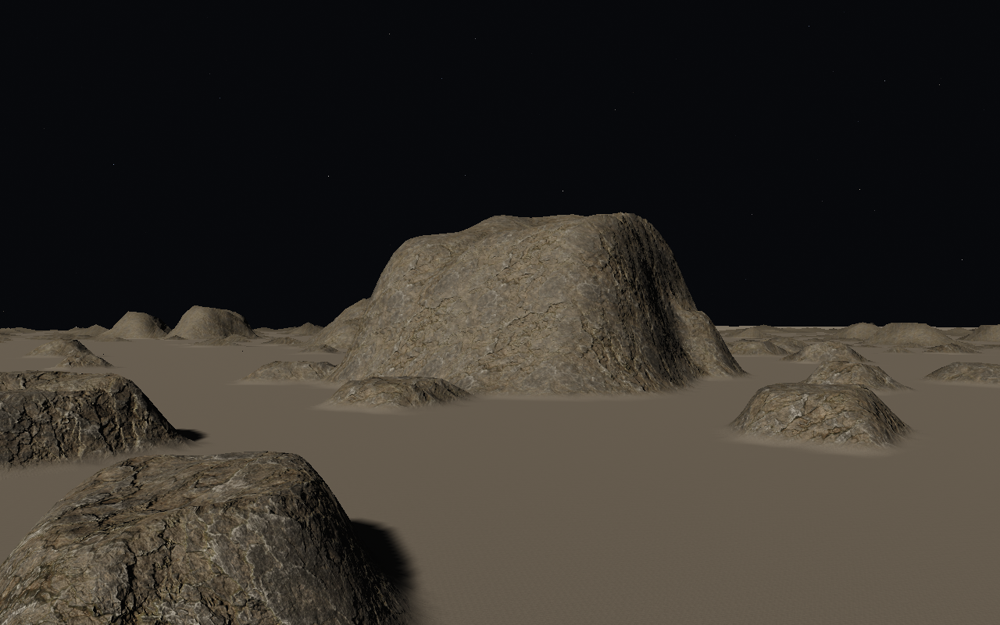
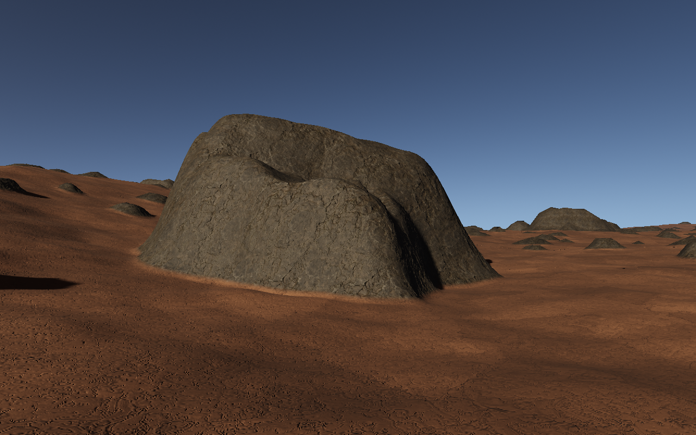
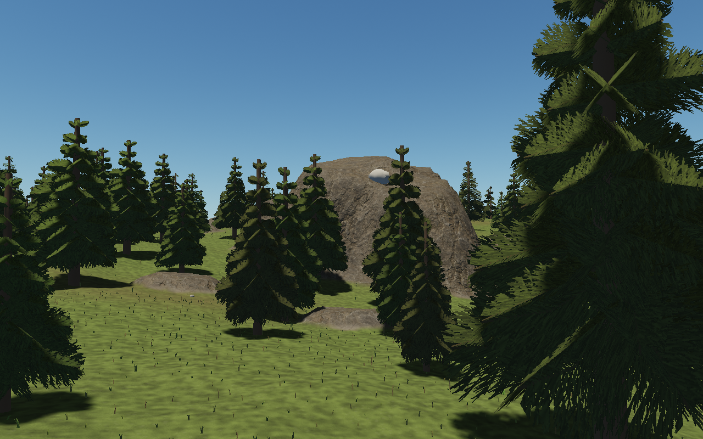

# Seeded rock formations

Aeon also has a separate rare landmark layer with roughly 50–120 m cliffs, leaning
fins, stone bridges and physical overhangs. These use shared textured meshes and
matching client/server collision above the canonical terrain. The older
heightfield layer described below remains in place, as do the smaller mineable
basalt stones. See [landmark implementation and game evidence](qa/landmark-rocks.md).

The missing middle scale between surface grains and mountains now comes from
`src/rock-formations.js`: metre-scale boulders and larger, fractured bedrock
outcrops. A 23 m cell field supplies small rocks; a 115 m field supplies outcrops
with independently rotated shoulders, worn caps, varied outlines and occasional
fractures. Regional density varies, leaving open terrain between groups.

The layer is evaluated inside the canonical surface samplers, so terrain workers,
collision, surface normals, resource rendering and plant placement use the same
height. No camera-driven random placement or extra collision floor is involved.
The field uses body-local doubles and three-dimensional cells, including all
neighbours that can overlap the sample. It has no cube-face or longitude seam.
Existing patch-local Float32 buffers, parent fallback, skirts and morphing remain
in charge of rendering.

- Aeon uses the selected planet seed. Outcrops fade away at beaches and polar ice;
  its seeded exposure mask covers faces and flat caps.
- Selene uses its existing independent body seed and darker exposed rock.
- Pyre uses its body frame and independent seed. Strongly active lava suppresses
  the new formations, and solid outcrops retain the local mineral palette.
- Miasma uses its independent seed and mineral palette; flora still follows the
  final surface and rejects steep ground.

Generator versions advance because surface heights and safe destination choices
can change. The existing forest-to-coast flight test now budgets for the actual
route length, since the safest forest destination can move.

These are solid **heightfield** formations: no caves, overhangs, movable rocks,
mining or new destruction system. Maximum added relief is below 50 m. They refine
with the existing terrain LOD; this does not replace the separate large-scale
Selene geology and surface-stone branches. The material follow-up adds locally bundled CC0 maps; no dependencies were added.

Validation commands:

```sh
npm test
npm run test:browser -- -c scripts/rock-formations.config.js
```

The unit suite includes seed reconstruction/variation, open ground, continuity at
cell boundaries and poles, and a swept collision crossing with both endpoints
clear of an outcrop. Existing tests check terrain/worker agreement and flight.
The Chromium test checks the three local map responses and readiness, builds production and captures Miasma at 350 m and 4 m, plus
Selene, Pyre and Aeon at 4 m, checking browser errors. A second check supplies an invalid-size map and verifies that the original materials remain usable. Evidence and environment
metadata are saved to `/tmp/star-agent-rocks`.

Verified on Chromium 151.0.7922.173, ANGLE Vulkan SwiftShader, 1280×800.
All 20 unit-test files pass. The formation browser run passed in 4.9 minutes with no
console errors; the material follow-up is recorded below. Captures use render scale 1; this is not a hardware FPS benchmark.







## Separate rock material

`src/rock-material.js` overlays the formations with the original 1K colour, OpenGL
normal and roughness maps from [ambientCG Rock030](https://ambientcg.com/a/Rock030),
licensed under [CC0](https://docs.ambientcg.com/license/). It replaces the ground
material on exposed stone instead of just tinting the existing soil. Subtle body
tints distinguish Pyre's darker rock and the cooler stone on Selene and Miasma.

A `rockRelief` attribute travels from each canonical sampler through the terrain
workers to the shader. Coverage includes flat caps and blends narrowly into dust
at the foot. Aeon and Miasma plant placement uses that same field to keep plants
off exposed stone. Geometry, seed positions and collision heights are unchanged
by this material pass.

Triplanar projection uses 2, 8 and 64 metre periods and the existing 256 metre
patch phase, preserving projection across terrain boundaries and origin rebases.
Surface-gradient normal blending follows the true terrain normal, including the
existing object-space patch normal maps. Fine normal detail fades with distance.

The three JPGs total **4,681,460 bytes** and share approximately **16 MiB of GPU
storage including mipmaps** across all four worlds. Albedo uses sRGB; normals and
roughness remain linear. The shared loader publishes the set atomically and
retains existing materials if decoding or dimension validation fails. Disposal
releases the set after the last world and handles late loads. Sources, licence
and hashes: [material manifest](../public/materials/outcrops/manifest.json).

Material verification (7 September 2026): all 20 unit-test files pass, including
worker mask agreement and flat-cap coverage. The production browser tour and
invalid-map fallback both pass (6.0 minutes total). All three material requests
returned HTTP 200, the shared set reported ready, and the tour recorded no
console/page errors. All five updated screenshots above were inspected. The
fallback test produces the expected warning and keeps rendering with the original
materials. Browser/backend/resolution are the same as listed above; texture
sampling adds fragment work and no hardware FPS claim is made.
