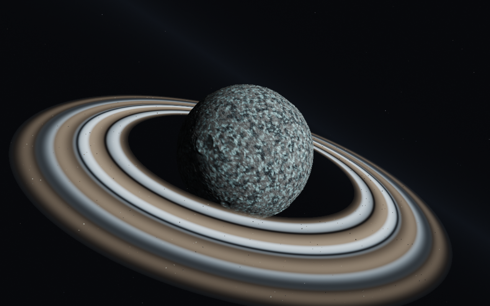
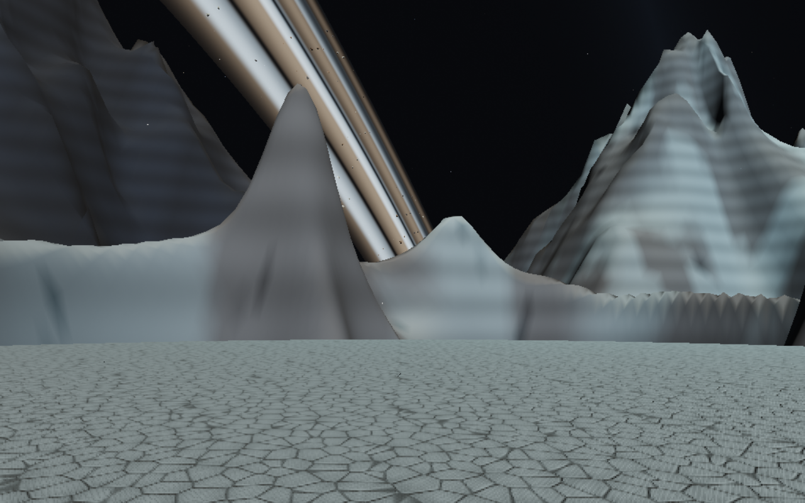
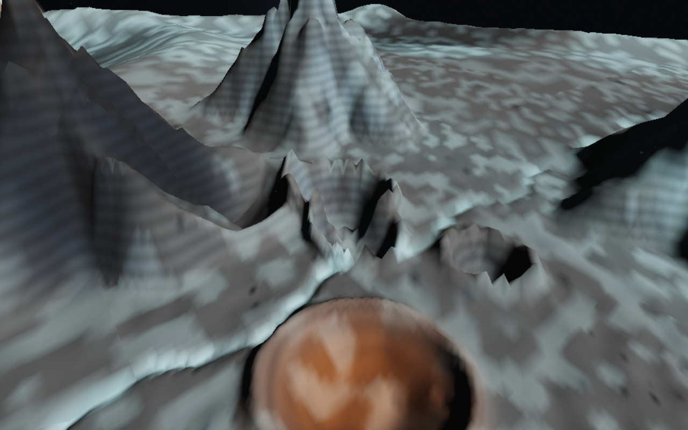

# Selene: crater country and ice rings

Selene now has a crater-rim landing shelf overlooking a broad impact basin,
fractured mountain ridges, smaller impact bowls, dark basalt outcrops and patches
of frost. Generator v4 adds much more extreme relief and recognizable districts:
Crescent Rim is the landing shelf, Glass Rift is a winding blue-white ice channel,
Obsidian Crown has dark mountain rock, Copper Ejecta is a warm impact deposit,
and Frostwall carries pale ice. The existing location display names the district.
The terrain is physical: flight contact, walking and visible ground all
sample the same surface. The central shelf leaves room to land and use the ramp.

Click **Selene**, press **L** to land, then **F** to leave the chair. Walk aft,
open the hatch with **F**, and step outside. Look across the basin and up at the
rings. **Space** jumps; return to the chair to sit and launch. Controller controls
are unchanged. All destination shortcuts are optional; normal flight also works.



A tilted belt surrounds the moon between 1.65 and 2.85 lunar radii. Four broad
ice/dust bands have narrower divisions and distance-filtered striations. Individual
procedural asteroids become visible near the belt. Selene casts a shadow across
both the bands and the rocks. The belt is scenery: asteroid impacts, mining,
orbital evolution and ring shadows cast back onto the surface are not implemented.





Near the ground, lofted ice grains drift and flash in sunlight. They fade with
distance, disappear inside the ship, and receive no direct light on the night side.
The effect is an artistic particle layer; Selene still has no atmospheric drag or
wind sound. It does not simulate sublimation, frost deposition or a gas atmosphere.

The visual direction combines stark volcanic terrain inspired by
[Cellin's official description](https://robertsspaceindustries.com/galactapedia/article/Rw1Z9yz1jJ-cellin-stanton-2a)
with Cees' requested ice glints and dramatic rings. All new geometry, textures and
particles are generated locally; no Star Citizen assets are used.

## Rendering and terrain contracts

- Lunar generator version **4** changes the surface globally and keeps its own fixed
  seed. Aeon's URL seed does not change the moon.
- The terrain broad-phase bound is **16,000 m** above the lunar reference sphere.
  The landing site remains the same direction but now sits on a different heightfield.
- Ninety-six global impact features are joined by 36 local craters and three broken
  peaks around the exploration site. Local basalt outcrops are also heightfield relief.
- Surface colors are sampled directly into patch vertices. Broad mineral masks
  distinguish districts; mipmapped triplanar fractured stone resolves walking detail.
  The old kilometre-per-pixel global color texture is no longer used.
- Required child meshes survive cache eviction even when horizon-culled. Visual
  checks wait for streaming to settle before judging mountain silhouettes.
- Patch normals reuse a one-cell sampling halo, so a patch's floor and shading agree
  without recomputing the generator four extra times at each vertex.
- Six quadtree roots retain parents and skirts as children load. Nearby orbital views
  refine to at least level 3; distant views keep level 2; close terrain reaches 17.
- Ring rocks use one instanced draw (1,800 rocks). Instance translations subtract the
  double camera origin before float upload, including when flying inside the belt.
- Ice occupies deterministic lunar cells with a fixed reusable GPU buffer. New cells
  update the existing attributes; moving through the effect does not leak old buffers.
- Rings use normal transparency; ice uses additive RGB without changing coverage.
  The HDR target retains transparent scene color over sky. Log-depth encoding and
  atmosphere distance reconstruction retain their existing convention.

## Verification

```sh
npm test
npm run build
npm run test:browser -- -c scripts/moon.config.js
```

The dedicated browser checks perform the real land–walk–jump–reboard–launch journey
and render orbit, crater approach, surface ice, a close asteroid and Aeon's coast.
Numerical checks cover terrain bounds, seams, precision, >20° slopes, substantial
basin relief, a level shelf, walking into the crater, ring gaps, asteroid positions,
particle persistence and geometry cleanup. Full evidence is saved under
`/tmp/star-agent-lunar-landscape-evidence`.

Terrain LOD still changes discretely and lunar patch generation remains synchronous.
The cache retains node metadata after evicting geometry. Visual checks use Chromium
and ANGLE/Vulkan SwiftShader; software screenshots do not establish hardware FPS.
Read [the planet pipeline memory](../PLANET-PIPELINE-MEMORY.md) for the broader
architecture and [the lunar handoff](../LUNAR-LANDSCAPE-HANDOFF.md) for integration.


Validation record: 77 unit cases and production build pass. Both production lunar
browser cases pass, including the physical exploration journey and return to Aeon.
The render tour was repeated after the final close-range ring/material refinement.
Curated images use Chromium 151.0.7922.173, ANGLE/Vulkan SwiftShader, 1280×800 at
render scale .8; gameplay journey uses .55.
