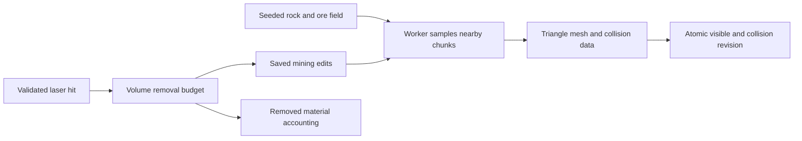

# Selene mining, rock assets and mountain research

Research date: 2026-09-06. Status: recommendation and implementation plan, **not an implemented mining system**. Requested by Cees, with No Man's Sky as a reference and technology choice open. Based on lunar PR #15 (`ea7c35b`) plus read-only inspection of the shared equipment/assets lane.

## Recommendation

Use a **hybrid terrain system**: retain Selene's streamed heightfield for planetary scale and most mountain ranges; add locally sampled, smooth volumetric rocks and ore outcrops that can be carved. Render those volumes as ordinary triangle meshes. Use static mesh formations for non-excavatable arches, fractured cliff details and distant scenery. Reserve local terrain replacement for a subsequent cave/excavation slice.

Voxels describe how solid material is stored and edited; they do not require visible Minecraft-style cubes. My recommended first mesher is worker-based Marching Cubes with consistent ambiguity handling, behind an interchangeable meshing interface. Evaluate Dual Contouring on the same test rocks if sharp cut faces prove inadequate. Do not begin by replacing the entire moon or migrating its renderer.

This supports the existing Phase 6 roadmap rather than creating a second mining architecture. Its promises of <4 ms remeshing, tiny permanent edit logs, and 0.5–2 m cells for all assets need qualification and measurement. The first research result is that **better mountain shapes and mineable material are separate problems**: voxels enable holes and overhangs, but do not automatically make convincing ridges.

## What the references establish

Hello Games' GDC 2017 presentation describes a voxel generation, polygonization, texturing and population pipeline. Its 2024 Worlds Part I notes explicitly report a move to **dual marching cubes**, with reductions in vertex count and memory and improved generation speed. These establish a useful architecture reference, not a browser performance guarantee or a full specification of their current mining implementation. Dual Marching Cubes and Dual Contouring are distinct algorithms. [Hello Games at GDC](https://www.gdcvault.com/play/1024265/Continuous_World_Generation_in__No_Man_s_Sky_), [Worlds Part I](https://www.nomanssky.com/worlds-part-i-update/).

| Approach | Best use on Selene | Cost or limitation | Decision |
|---|---|---|---|
| Heightfield with directional ridges and slope materials | Planet, craters, long mountain chains | One surface height per direction; cannot represent tunnels | Keep and improve |
| Static or pre-fractured meshes | Arches, sharp cliff dressing, harvestable chunks | Predefined breaks; arbitrary excavation needs another representation | Use selectively |
| Smooth scalar-field chunks + Marching Cubes | Carvable boulders, ore banks, local excavation | Remeshing, boundary ownership, collision updates and persistence | First mining prototype |
| Dual Contouring | Sharp crystal/rock faces and cut edges | Requires intersection normals and robust vertex fitting/topology handling | Compare after baseline |
| Dual Marching Cubes | Adaptive feature-preserving volumes | More substantial adaptive meshing integration | Later research candidate |
| Repeated triangle-mesh CSG | A few sculpted cuts on closed props | Input quality and repeated-cut robustness need testing | Comparison case, not default |
| GPU raymarched volumes/full GPU voxel renderer | Specialized future renderer | Custom depth, shadows, picking and CPU collision integration | Defer |

Dual Contouring uses Hermite intersection/normal information to preserve sharp features. Dual Marching Cubes instead contours a grid dual to the structured sampling grid. Their papers justify testing these approaches, but do not establish which wins for our rocks, hardware and edit sizes. [Dual Contouring paper](https://www.cs.rice.edu/~jwarren/papers/dualcontour.pdf), [Dual Marching Cubes paper](https://www.cs.rice.edu/~jwarren/papers/dmc.pdf).

`three-bvh-csg` is an available comparison implementation, described by its maintainer as experimental/in progress. Its suitability for hundreds of repeated mining cuts must be measured on our asset topology. [Maintainer repository](https://github.com/gkjohnson/three-bvh-csg).

## Existing project integration

| Existing source | Observed capability | Missing work |
|---|---|---|
| `src/moon-world.js` in PR #15 | Canonical height/material fields and named geological districts | Volumetric assets and edit state |
| `src/moon-terrain.js` | Local-coordinate meshes, parent fallback, horizon culling, bounded per-frame builds | Volumetric streaming and terrain replacement boundaries |
| Shared `src/equipment.js` | Laser heat/overheat and `onMine({item, point, dt, rate, heat})`; rate is documented as m³/s | Verified scene hit and carve/resource transaction |
| `src/celestial.js`, `src/navigation.js` | Radial altitude, ground support and lunar swept contact | Overhang/cave-aware collision and volume support |
| `src/ship-inventory.js` | Existing item manifest, pack/ship capacities and local persistence | Ore items, fractional extraction accounting, cargo-full behavior |
| Shared `public/models/props/` | Cracked/layered boulders, arch and crystals | Closed-volume qualification, interior materials, destruction representation |

The equipment callback currently reports the beam endpoint; it does not by itself prove an ore hit. Supply the nearest valid camera/muzzle hit, check obstruction and range, and copy the callback's reused point vector before queuing asynchronous work. The equipment lane is separate from the lunar review branch; do not infer that its hook is wired into every running build.

### Asset shortlist

Prefer a procedural volumetric rock as the **first mineable asset**. It has a defined interior, stable seed and ore field from the beginning. Existing or downloaded meshes remain useful for silhouette references, distant instances, decoration, and later offline conversion.

| Candidate | Evidence / intended role | Qualification still needed |
|---|---|---|
| Existing `boulder-cracked.glb` | 9,999 stored mesh triangles, 496,176 bytes; manifest describes a 3 m fractured boulder | Closedness, self-intersections, internal material and a lower-detail mesh |
| Existing `boulder-layered.glb` | 10,000 triangles, 483,664 bytes; manifest describes a 1.5 m stratified rock | Same; useful for Copper Ejecta's visual language |
| Existing `rock-arch.glb` | 10,000 triangles, 584,416 bytes | Useful landmark/collision prop; destruction/support behavior is a later decision |
| Existing `crystal-cluster.glb` | 10,000 triangles, 490,432 bytes | Sharp-shape mesher comparison; do not silently change roadmap crystal distribution |
| [Poly Haven Boulder 01](https://polyhaven.com/a/boulder_01) | External jagged, weathered rock model and PBR reference | Remove terrestrial lichen, optimize, inspect underside/topology before SDF conversion |
| [Poly Haven Cliff Side](https://polyhaven.com/a/cliff_side) | **Texture**, not a destructible mesh; cliff material reference | Physical texture scale, repetition and color matching |

Local GLB counts and hashes are recorded in [the asset audit](selene-mining-asset-audit.json). This is a metadata audit, not a watertightness test or a visual approval. Reproduce against a checkout containing the assets:

```sh
python3 scripts/research/audit-mining-assets.py /path/to/star-agent/public/models/props
```

Poly Haven publishes its assets under CC0. Keep an asset provenance record even when attribution is optional. No external asset was downloaded, purchased or imported during this research. [Poly Haven licensing](https://polyhaven.com/license).

### Proposed mineable asset package

Each rock should supply a stable ID, body-relative transform, metre scale, bounds, generator/version, base density function or offline density brick, interior material/ore field, distant mesh, material settings and persisted edits. A GLB alone supplies surface geometry and materials, not ore content or carving behavior.

For mesh-derived assets, repair/close a copy offline and bake signed density plus material identifiers; retain the original detailed mesh as a distant/reference asset. Test sign classification on concave shapes and disconnected pieces. Newly exposed surfaces need volumetric/triplanar interior materials; an exterior photograph or UV unwrap cannot describe an unseen cut face. Validate that the unedited near volume and distant mesh have matching silhouettes before switching representations.

## Ridges and mountains: improve shape before changing storage

The current v4 mountains derive much of their form from radial peak envelopes plus noise. My assessment of the committed views is that this still tends toward isolated cones and smooth steep walls. More amplitude alone does not create a mountain range.

Proposed next terrain pass:

1. Define connected ridge spines in Selene's local tangent frame, with subsidiary ridges, asymmetric faces, saddles and traversable passes. Keep their layout deterministic and tied to named districts.
2. Use directional/domain-warped detail aligned to those spines; avoid uniform noise everywhere. De Carpentier's procedural erosion and directional brushes demonstrate ways to get connected, eroded-looking forms without converting a heightfield into voxels. Adapt the morphology artistically for an airless moon rather than claiming active rivers. [Procedural extensions](https://www.decarpentier.nl/scape-procedural-extensions), [Directional brushes](https://www.decarpentier.nl/scape-brush-pipeline).
3. Separate scales: kilometre silhouettes, tens-to-hundreds-of-metre ledges and talus, metre boulders, then surface fractures. Do not put texture-scale noise into coarse terrain vertices.
4. Place angular cliff modules and embedded mineable outcrops on exposed faces. Mesh overhangs need real collision; a normal map cannot alter a silhouette or create shelter.
5. Give mineral formations readable geological placement: dark fractured material at Obsidian Crown, ice-rich seams along Glass Rift, warm deposits around Copper Ejecta. Start with rock/metal/ice; keep crystals consistent with the cave roadmap unless product direction changes.
6. Review from the actual landing shelf, a walking route, crater floor and low flight. Preserve the safe ramp area. Compare recognizable profiles and routes, not just maximum elevation.

## Proposed technical slice



**Sampling and carving.** Adopt an explicit convention: negative field values mean solid. A subtraction brush uses `Fnew(p) = max(Fold(p), -B(p))`, where `B` is negative inside the brush. Noisy/warped fields and radial height residuals are not automatically true signed distances: do not rely on unbounded sphere tracing or distance-based contact without a conservative bound. Marching Cubes needs sign samples, so a general scalar field is sufficient. Use authoritative chunk triangles/BVH or a separately proven field query for collision.

Start with one 2–4 m boulder at 0.125 m cells and one approximately 8 m outcrop at 0.25 m cells. A 32-cell chunk spans 4 m or 8 m respectively. Larger boulders can test 0.5 m cells. The roadmap's 2 m samples cannot resolve a 0.6 m mining brush reliably. These are proposed test settings, not measured optimum values.

A 32³-cell chunk requires 33³ corner samples: float density plus one byte of material per cell is about **172.4 KiB**. Adding one sample halo on each side makes that about **199.5 KiB**, before normals, geometry, collision, worker copies or GPU buffers. A dense 1 km cube at 0.25 m spacing would cost roughly **256 GB for float density alone**. Therefore sample/cache only needed chunks; do not voxelize whole mountains or entire kilometre-sized ring rocks at mining resolution. Arithmetic is reproduced by the asset audit script.

**Worker meshing.** Use transferable typed arrays, dirty-chunk queues and shared border coordinates. Update adjacent chunks when edits reach their sample/normal halos. Begin with fixed resolution per small rock; implement mixed-resolution seams only when needed. Transvoxel supplies transition cells for neighboring voxel meshes at 2:1 resolution, and is explicitly free of patent claims. Its tables are useful for a compatible Marching Cubes path, not a drop-in seam solution for arbitrary meshers or the moon's heightfield. [Transvoxel](https://transvoxel.org/).

**Mesh choice.** Three.js already exposes a MarchingCubes addon and the installed copy allocates density, normal and mesh buffers. Use it as a reference/small comparison, not proof of a complete streaming mining engine. Its default metaball helper should not determine the rock's shape; use a purpose-built scalar field. [Three.js MarchingCubes](https://threejs.org/docs/pages/MarchingCubes.html).

**Representation changes.** Keep stable object-local integer sample coordinates; subtract the world origin in double precision before GPU upload. Far instances must reflect edited silhouettes—replacing a mined rock with its pristine distant mesh would resurrect it visually. Generate/cache an edited coarse proxy, or retain the edited mesh until a valid proxy is ready. Retain the old visible/collision revision together while a worker prepares a new one; discard stale jobs, then publish the matching pair. A player standing on removed material must fall under lunar gravity, not stay on an invisible old support surface.

**Resource accounting.** Accumulate the laser's `rate * dt` into a bounded removal budget. Coalesce beam samples; do not subtract a full fixed-radius sphere every render frame. Award resources only for newly removed solid material, integrated over the removed samples' ore composition. Repeatedly hitting an empty hole yields nothing. Persist edits and resource credit as one transaction with an operation ID; reload/replay cannot credit twice. Decide cargo-full behavior explicitly (pause extraction for the first slice is simplest). Fractional resource quantities need accumulation before converting to inventory units.

**Persistence.** Store object ID, generator/material version and quantized local edit operations. Spatially index edits per chunk and periodically compact old operations into density deltas/checkpoints. Brush logs grow without bound if never compacted; procedural replay across versions/platforms requires canonical quantization and tests. IndexedDB is a candidate local store; multi-player authority/replication remains a separate Phase 5 integration requirement.

**Planet excavation.** A rock above intact terrain can use additive local collision. A hole through the mountain cannot: merely hiding the surface shader leaves the old radial walking floor. A later volume replacement domain must own rendering, laser hits, swept collision, ground support and cave entrance boundaries together. Sample the radial terrain field plus cave edits inside that domain, stitch/mask its boundary deliberately, and persist domain ownership. This is the main reason to prove standalone mineable rocks first.

**Renderer.** Retain the current WebGL2/logarithmic-depth path and standard mesh materials for the prototype. Three.js documents that migration to WebGPURenderer requires porting `ShaderMaterial` and `onBeforeCompile` customization to node materials/TSL. Selene's material and atmosphere use those existing paths, so renderer migration would be a separate project. WebGPU compute may be worth profiling later; it is not a prerequisite for worker-meshed voxels. [Three.js migration guidance](https://threejs.org/manual/en/webgpurenderer).

## Next experiment and acceptance gates

Build a standalone rock studio, then one embedded outcrop near Crescent Rim, using the existing tool hook when its integration is available. Proposed stages:

1. Seeded angular rock with rock/ore/ice interior fields; carve with a mouse brush and compare Marching Cubes against a static mesh reference.
2. Dirty-chunk worker remeshing, real ray hits/collision, material-aware extraction and save/reload. Check two adjacent chunks and edits through an edge/corner.
3. Wire the mining laser/heat and inventory; test a full land–walk–mine–stow–leave–return journey with keyboard and controller.
4. Compare Dual Contouring on the same sharp rock if needed. Expand to cliff outcrops, then a single cave entrance only after volume-owned collision works.
5. Independently replace isolated cone mountains with connected ridges and material-aware cliff formations.

Measure worker mesh time and end-to-end input-to-visible-edit latency separately. Initial **targets, not results**: p95 edit latency under 100 ms, main-thread publication under 2 ms/frame, and under 128 MiB of resident mining data/geometry in the small test scene. Record hardware/browser/resolution, p50/p95, loaded chunks, triangles and CPU/GPU memory estimates; software Chromium screenshots are for correctness, not hardware FPS claims. Treat the roadmap's <4 ms chunk goal as a profiling target, never a promise.

Acceptance must include deterministic replay, no reward for empty space, capped extraction rate, no obsolete worker result overwriting a newer edit, no chunk cracks, matching visible and collision revisions, persistence under eviction/reload, no regrowth at LOD changes, material on cut interiors, and no hidden heightfield floor in an excavation domain. Test detached fragments explicitly: first slice can remove harvested fragments with short-lived debris, but must not imply structural collapse physics.

Research completed here: primary-source review, local architecture/equipment inspection, four-asset GLB metadata audit and reproducible memory arithmetic. No miner, voxel renderer, cave system, asset conversion or runtime performance benchmark was implemented in this research branch.
