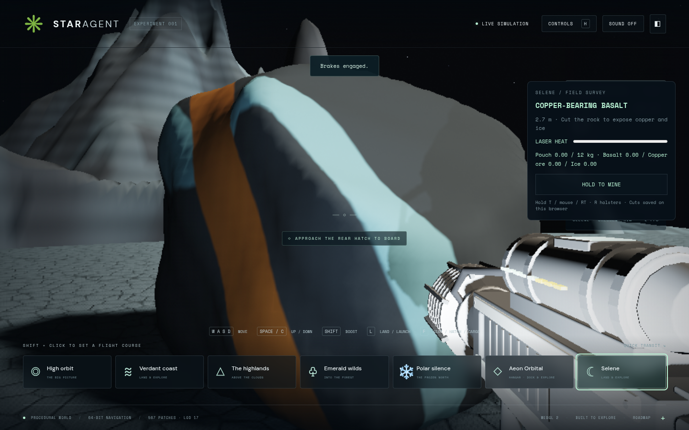
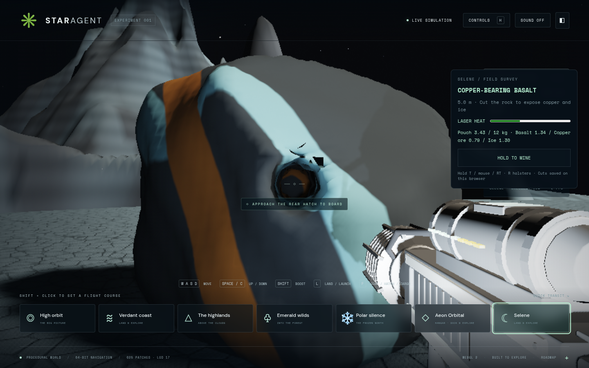

# Selene mining: first playable rock

A copper-bearing basalt boulder sits beside Crescent Rim's landing shelf. The
mining laser removes real volume, opens holes and exposes copper and ice inside.
The current mesh also supplies the rock's walking, tool-ray and ship-clearance
collision. Cuts and collected survey samples survive a reload on this browser.

## Try it

Production preview: http://127.0.0.1:5203/ (`star-agent-mining.service`). This is a
separate preview; port 5180 still serves the earlier geology branch.

1. Select **Selene**, press **L** to land, then **F** to leave the chair.
2. Walk aft, open the hatch with **F**, and follow the ramp outside.
3. Follow the **Crescent deposit** distance/bearing in the survey panel. The rock
   is about 20 m from the landing centre, to one side of the ramp.
4. Approach within **8 m**, aim at the rock and hold **T**, the captured mouse's
   left button, or Xbox **RT**. The panel's **Hold to mine** button also supports
   touch and keyboard activation. The laser equips automatically nearby; **R**
   holsters it and **3** equips it again.
5. Let the laser cool when it overheats. Copper and ice follow interior seams;
   the dark material is basalt. A mounted light helps inspect the cut.
6. Return to the ship's cargo access, press **F**, and choose **Deposit all resources**.
   The starter backpack holds 48 kg and the initial ship boxes hold 192 kg of
   materials, sharing the inventory with expedition supplies. A second backpack
   box raises its material capacity to 96 kg. Mining level appears in that inventory.

Mining saves are stored under `star-agent.selene-mining.v1`. Storage failure pauses
mining without publishing the unsaved cut or granting its samples. An unreadable
save is retained and mining pauses. The first slice provides no reset/delete UI.




## Implemented architecture

- `src/mining/volume.js`: deterministic, angular density field; copper/ice material
  fields; volume-budgeted spherical subtraction; mesh generation and float snapshot
  encoding. One 4 m volume contains 32³ cells at 0.125 m spacing.
- Meshing uses a **consistent six-tetrahedron split per cube** for this first fixed
  volume. This avoids ambiguous cube faces without importing another meshing library.
  It produces more triangles than the Marching Cubes path proposed in the research;
  it is not Dual Marching Cubes. Both pristine and carved mesh edges have a closure
  regression. No mixed-resolution stitching is required for this single rock.
- `worker.js`: carving, meshing, collision-tree construction and snapshot encoding
  run off the render thread. Transferable arrays carry the result. A single active
  job and capped/coalesced tool budget avoid an unbounded queue.
- `collision.js`: a bounded hierarchy of triangle boxes, triangle ray hits and
  conservative capsule advancement. The same published mesh blocks walking, supports
  standing/jumping, and stops conservative ship-clearance sweeps. Lost support
  resumes the existing lunar gravity. The ship uses a conservative 10 m sphere;
  this is not precise hull contact or a rock crash/damage simulation.
- `rock.js`: stable body/local frame, double origin subtraction, worker revision
  checks, geometry disposal and publication. Geometry/collision publish together
  only after the matching save succeeds. The edited mesh remains the distant
  representation too; an old pristine instance cannot resurrect the rock.
- `store.js`: one localStorage transaction includes density and both sample
  containers. The compact snapshot preserves float samples exactly. Replaying the
  same revision cannot award another yield. Collected mass is a gameplay concentrate
  yield (1 kg/m³ removed for new cuts; existing cargo stays unchanged), not the physical density of basalt/ice. Empty space
  yields no resources; the removal budget and remaining pouch capacity cap each cut.
- `tool.js`: a first-person socket adapter reuses the existing `Equipment` class,
  heat/overheat behavior, laser beam and procedural Blender mining-tool model from
  manager commit `9930e82`. No duplicate gun/heat implementation. The adapter uses
  camera-mounted sockets rather than adding a full character rig to the lunar branch.
  The same validated world hit can feed the character/equipment lane later.

The mineral function also shades newly exposed faces in local coordinates, so
interior material does not depend on an exterior UV photograph. Mineral boundaries
are resolved in the fragment shader. A shadowed tool spotlight illuminates the cut.

## Integration boundaries

Based on `docs/selene-mining-research` (research PR #18), which includes lunar PR #15.
Only the mining laser model/manifest row, equipment module, socket calibration and
its existing tests are adopted from the gear lane. Preserve newer manager versions
when merging; the remaining gear assets are not replaced here. The original model
builder is `blender/build_gear.py` at `9930e82` on the manager's history.

`main.js` creates the rock/tool, supplies the origin each frame, attaches the
optional navigation obstacle and exposes `state.mining` diagnostics. `gamepad.js`
adds the armed right-trigger value without changing flight movement. `navigation.js`
adds the optional obstacle hooks and support-aware jumping. `ship-inventory-ui.js`
adds the survey pouch/locker section without changing supply-item transfers.
Do not overwrite concurrent map, travel, character or equipment integration hooks.

The existing moon surface remains authoritative under the rock. This slice does
not excavate the planet or create caves. A later excavation domain must replace
both the visible heightfield and its radial walking floor, as the research explains.

## Verification and practical limits

```sh
npm test
npm run test:browser -- -c scripts/mining.config.js
```

Final validation: **116 numerical cases and all 3 browser journeys passed**, with
no page or console errors in the mining journey. The preview serves the tested
`index-DpEVt4cu.js` build. See the [evidence record](qa/selene-mining/evidence.json),
[phone view](qa/selene-mining/phone.png) and [sample locker](qa/selene-mining/cargo.png).

The mining browser journey physically lands and walks out to the deposit, carves
with the laser, reloads the save, mines with a standard Xbox trigger and real touch
input, and stows samples through the cargo dialog. Re-entry to the cargo position
in the final isolated storage check uses test navigation hooks; the independent
lunar journey covers physical reboarding and launch. Desktop evidence is 1440×900;
phone evidence is 390×844. The mining scene uses render scale .65, with automatic
scaling enabled after its reload. Ring/surface/Aeon regression views run separately.

Numerical coverage includes deterministic fields, volume budgets, no rewards for
empty holes, closed mesh edges, physical ray/capsule changes, standing/support loss,
packed collision equivalence, exact save reload, stale worker rejection, full
pouch and storage failure. Browser metadata and sampled timings are in the evidence
record. The sampled complete worker job took 352 ms and main-thread publication
took 2.6 ms. The worker still exceeds the proposed sub-100 ms target. These
software-rendered observations are not hardware FPS or p95 guarantees.

This is one standalone mining volume with whole-rock remeshing. It has no dynamic
fragment physics, structural collapse, ore crafting/selling, multiplayer authority,
concurrent-tab coordination, cave excavation, whole-mountain destruction, or
mineable ring asteroids. Disconnected remnants can remain suspended until mined.
The local snapshot is bounded by one fixed grid, avoiding an ever-growing brush log.
Larger populations need streaming, reduced triangle counts and performance work.

Fable/Claude still own integration and the independent visual review. Functional
checks and screenshots do not constitute an Opus rubric approval or deployment.
