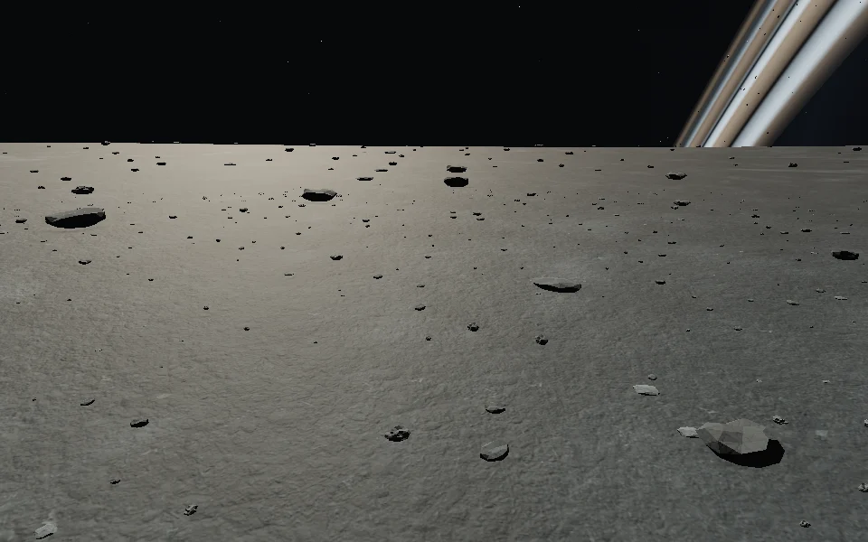
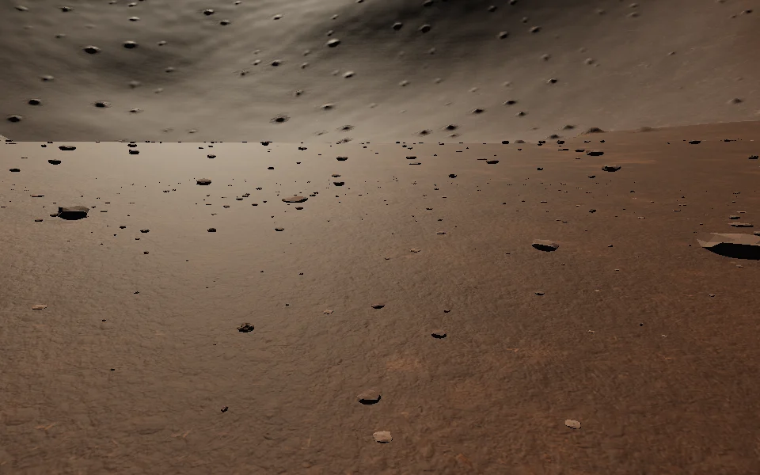

# Selene surface stones

Selene now has loose pebbles and low rocks on its canonical lunar terrain. Three chipped shapes, varied proportions, rotations and colours break up repeated silhouettes. Basalt fragments, pale chips and warmer ejecta stones inherit local colour and frost from `moonSurface`. The material reuses Selene's existing fractured-stone texture for granular colour and bump relief.

Pebbles are roughly 3.5–17.5 cm across and fade between 12 and 18 metres. Rocks are roughly 22–87 cm across, with low profiles under 40 cm, and fade between 75 and 100 metres. They are decorative, non-mineable detail; the existing larger terrain outcrops retain their canonical collision. The ship's 13-metre landing clearing remains clear.

Both layers use deterministic lunar cells, including wrapped longitudes and full polar caps. Each stone is partially embedded in the canonical heightfield and oriented to its sampled slope. Cached records preserve placement while moving. Camera origins are subtracted in JavaScript doubles before local instance matrices reach the GPU. Pebbles stream after 2 metres of travel and rocks after 8 metres, with buffers covering their full fade ranges.

There are six instanced colour draws, capped at 7,200 pebbles and 4,800 rocks; actual populations are lower. Rocks cast distance-faded shadows, and both sizes receive shadows. No dependencies or downloaded assets were added. Terrain, walking physics and mining remain unchanged.

## Verification

- `npm test`: 97 tests pass, including stable lunar stone identities, canonical anchors, polar/seam coverage, landing exclusion and distance gating.
- `npm run test:browser -- -c scripts/moon-stones.config.js`: production build and Chromium rendering on the landing shelf and Copper Ejecta, with camera movement and altitude culling. Checks JavaScript/console/shader errors and saves evidence to `/tmp/star-agent-moon-stones`.
- Screenshots use Chromium and ANGLE SwiftShader at 960 × 600, with render scale 1. This is visual correctness evidence, not a hardware FPS measurement.

Visit Selene and walk beyond the ramp clearing, looking slightly down. Pebbles appear around your feet; the larger fragments remain visible farther out.

