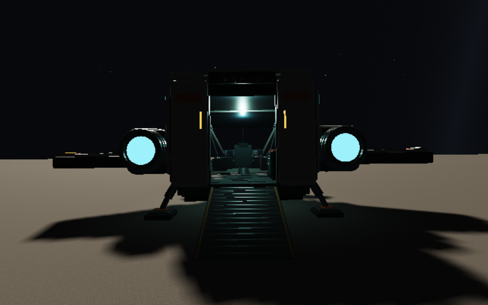

# Land and explore Selene

Click **Selene** in the destination list to arrive 180 m above the lunar surface.
Shift-click sets a course instead, allowing you to fly there continuously.

1. Press **L** to land.
2. Press **F** to leave the pilot chair and walk aft with **W**.
3. At the rear hatch, press **F**, wait for the ramp, then walk down it.
4. Explore with **WASD**, look with the mouse/arrow keys, and jump with **Space**.
5. Return up the ramp to the chair, press **F** to sit, then **L** to launch.

On a standard controller, **Y / △** lands or launches, **X / □** interacts,
the left stick moves, the right stick looks, and **A / ×** jumps while walking.
**O** or **High orbit** returns to Aeon.

Selene has real crater terrain and 1.62 m/s² surface gravity. Its HUD altitude
measures height above the local ground, including crater floors below the reference
sphere. It has no atmosphere, water or vegetation. Its fixed 24,000 km distance
from Aeon and 434.35 km radius are prototype choices; orbital motion is not simulated.

Screenshots: Chromium 151.0.7922.173, ANGLE/Vulkan SwiftShader, 1280×800, render
scale 0.55. These are software-rendering checks, not hardware frame-rate evidence.

For implementation, precision, terrain streaming, physics and QA instructions,
read [the complete planet pipeline memory](../PLANET-PIPELINE-MEMORY.md).
