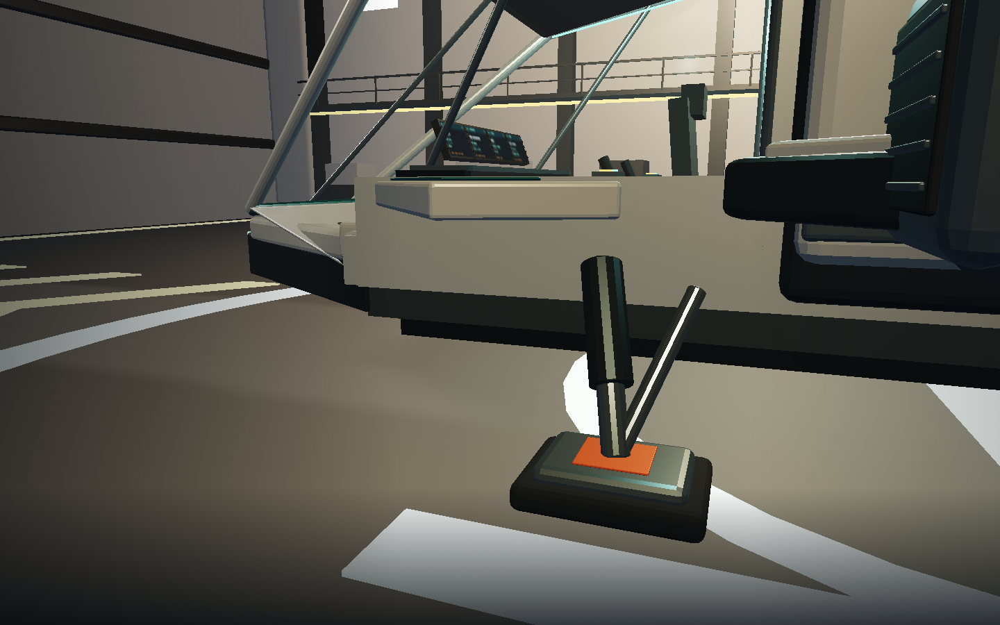
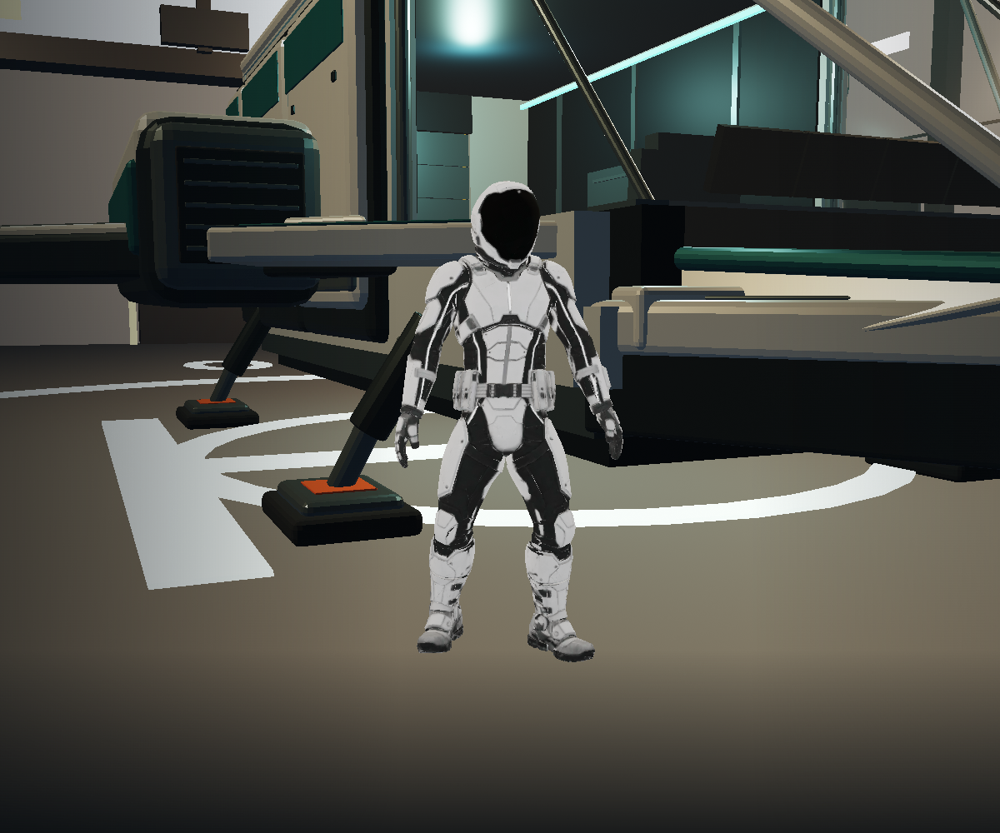
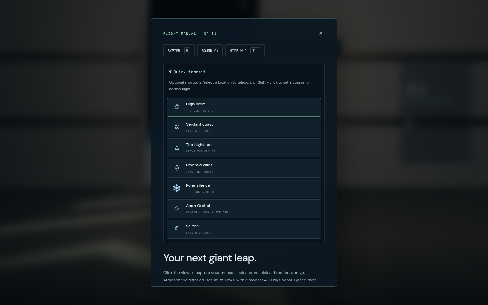

# The hangar opening

A normal visit starts on Aeon Orbital's deck beside the landed Nomad, with the
ship's hatch closed. The pilot uses the existing rigged Meshy male astronaut.

The camera looks past the pilot and ship as the bay doors reveal Aeon's cloud
tops and atmosphere. The ten-second dolly includes a small breathing sway.
A walking hint fades in after six seconds. Press W, another movement key, or
move the controller's left stick at any time during the reveal. The camera
blends into the physical first-person eye over 0.9 seconds; a short input buffer
preserves a tapped first step. Gameplay and interactive HUD controls resume when
the blend finishes. Doors continue opening if you take control early.

Walk around the ship to its rear hatch. F opens the hatch and lowers the ramp.
Walk up the ramp and forward to the pilot chair, then F sits and L launches.
The hangar doors and ship ramp retain their physical collision checks. There is
no boarding teleport. O and optional destination shortcuts work after the intro.

Audio stays off until a browser user gesture. The first keyboard movement enables
quiet hangar/motor audio; the sound button remains available afterwards. A polled
gamepad alone does not create an AudioContext. Sound is optional for all gameplay.

Use ?intro=0 to start in orbit, including for older test tours. Reload without
that parameter shows the opening again. The opening uses a deterministic twilight
station location and a deck tilted 20 degrees toward Aeon, placing the sun about
25 degrees off the door axis. The planet generator and seed are unchanged.
Legacy orbital tours retain the previous station pose.

## Implementation and limits

- opening-sequence.js owns orchestration, the existing Character/CharacterCamera
  adapter, input handover and the minimal intro UI. The camera is six metres aft,
  2.6 metres above the feet and four metres to the side to clear the Nomad wing.
- Navigation owns the deck-supported spawn and all subsequent movement.
  Station owns the true deck normal, optional orientation and animated colliders.
- The player, ship and main station assets load behind the existing loading screen.
  The initial scene renders before the cinematic clock starts, so shader setup
  cannot consume the door reveal. A failed station load falls back to orbital play;
  character/ship loaders retain their existing fallback models.
- Rendering uses the actual cinematic camera origin for planet, moon, atmosphere,
  station and vegetation. CPU positions stay in double-precision metres.
- Warm bay lamps, reduced interior sun and the existing fixed exposure frame the
  reveal. The audio is synthesized; no external audio APIs or assets are required.

The request's sub-three-second first shot and 60 FPS laptop targets are **not
verified**. Local cold production starts took roughly nine seconds using Chromium
with ANGLE/SwiftShader at 1440×900. Hardware GPU performance still needs measuring.
The authored station and pilot assets retain their current material/animation
quality; this work does not claim the long-term Star Citizen fidelity target.

Run npm test and npm run test:browser -- -c scripts/opening.config.js.
The dedicated tour captures the reveal and physically walks, boards and launches;
a second case checks controller handover and the orbital opt-out. Screenshots are
saved to /tmp/star-agent-opening-*.png; captures pause navigation while rendering
the opening at native resolution, then resume the live journey.

The hangar's structural floor ends beneath the finished landing deck. Both station
LODs enforce that separation so coplanar surfaces cannot fight for the visible
floor pixels. The walking surface and pad anchors remain at their authored height.

Floor-fix validation: 123 unit cases, production build, physical boarding/launch,
and moving-camera floor captures at native and 0.55 scale passed. Image captured
in Chromium 151 / ANGLE Vulkan SwiftShader at 1440×900.

The starter pilot rests with both arms down and subtle idle movement. The original
standing body and planted feet are retained; only the idle's arm rotations changed.

Taking control with W or the left stick dismisses the launcher header, promotional
panel and footer. They stay dismissed when the mouse is released, when menus are
closed and after quick transit. Flight telemetry, interaction guidance and the
cockpit MFDs remain available. Shift+Tab cycles HUD visibility for screenshots; Tab opens Contracts.

The optional **Flight guide** stays on one observed step: start walking, go to the
Nomad’s rear hatch, open it, board and close it, reach the pilot chair, take off,
retract gear, then choose a destination or contract. It continues through drive
charge, approach and landing. **Menu → Settings → Flight guide** turns it off.
Controls follow keyboard, standard controller or touch input. Touch players can
tap the opening view and use the Nomad’s walk, launch, thrust and brake buttons.

Press H or controller Menu/Options for settings. **Quick transit** is a collapsed
dropdown there: selecting a location uses an optional teleport; Shift + click sets
a course for regular flight. Choosing either closes the menu. M opens the system
map directly. Sound and Hide HUD controls also live in the options panel.

