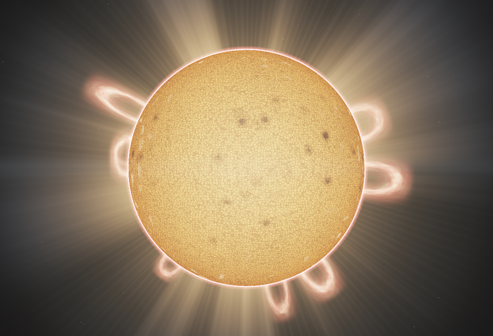
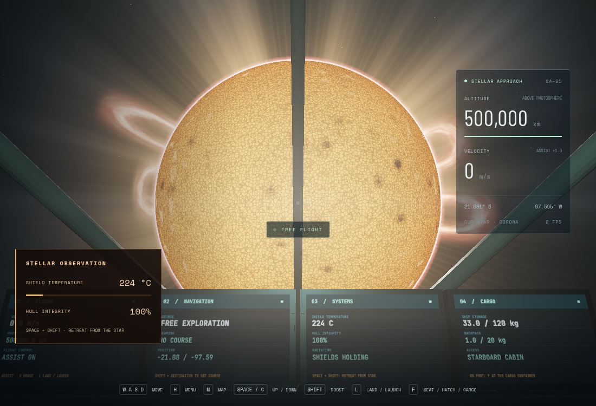
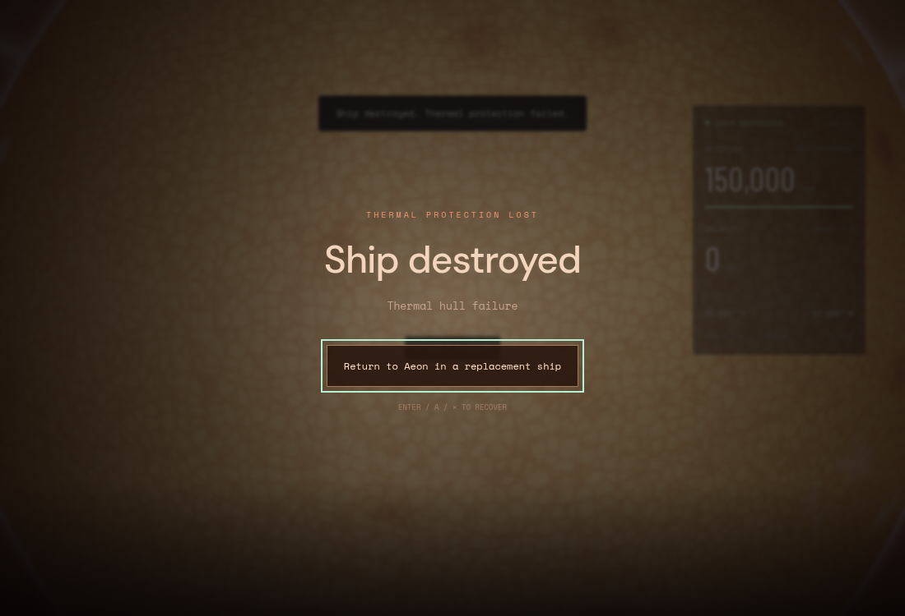

# A stellar encounter

The star is a travel destination with a 240,000 km photospheric radius. Its centre remains 25 million km from Aeon. Its apparent diameter is about 1.10° from Aeon (twice the previous disk), about 2.75° from Pyre, and 37.8° at the observation point. Apparent size follows `2 asin(radius / distance)` throughout the system.

**H → Quick transit → Our star** opens the observation view. **M → Our star → Engage drive** flies the continuous route, taking roughly 100 seconds from Aeon orbit. Both stop **500,000 km above the photosphere**, or **740,000 km from the centre**. The star cannot be landed on. Normal flight uses faster stellar cruise near the star; **Space + Shift** thrusts radially away, and **X** brakes. The map pauses flight and thermal simulation, like the other destinations.

## Surface, corona and light

The camera-relative photosphere has animated cellular granulation, sunspot groups, limb darkening, bright faculae and evolving flare sites. Eight prominence loops grow and fade, with two periodically lifting away. A corona with streamers and fine rays surrounds the disk. Lens glare is reduced or hidden by Aeon, Selene and Pyre occultation. The atmospheric composite retains additive light without opaque depth, allowing the corona to render against space while opaque cockpit geometry still occludes the photosphere.

The photosphere is a unit sphere with an object scale; the camera origin is subtracted from the star's centre in CPU doubles before matrix upload. Custom shaders use the scene's logarithmic depth chunks. All content is procedural and local; there are no new packages, remote textures or API requirements.

These are artistic observation-camera colours and exposure. Prominences are view-aligned procedural ribbons, not a magnetohydrodynamic simulation. The star rotates once per ten minutes for visible motion, not at a real stellar rotation rate. Local navigation has no N-body stellar gravity solver.

## Thermal protection and loss

The shield model uses inverse-square radiant flux, normalized to 1,361 W/m² at Aeon, with a fictional reflective shield (absorptivity 0.075 and emissivity 0.85). Its equilibrium temperature follows radiative cooling; the shield approaches that temperature over time. Displayed temperature describes the shield, not the cabin. Damage persists until an explicit replacement ship is requested; retreat cools the shield but does not repair the hull. Hull state is per session and is not saved across page reloads.

| Surface clearance | Behaviour |
| --- | --- |
| 500,000 km | Safe observation point; equilibrium shield temperature about 975 °C. |
| About 390,000 km | Radiation warning anticipates unsafe shield heating. |
| About 240,000 km and closer | Sustained exposure can exceed the 1,277 °C damage threshold. Loss accelerates with temperature. |
| 100,000 km | Drive exclusion boundary. Manual thrust can cross it, with severe heat risk. |
| 20,000 km | Immediate destruction, checked with swept contact so overspeed cannot skip the boundary. |

Destroyed ships lose controls and display a thermal failure screen with a short flash/debris effect. **Return to Aeon in a replacement ship**, **Enter**, or the controller's **A / cross** button resets the ship explicitly. Explosion audio uses only the audio context already enabled by a player gesture. This thermal destruction system remains separate from the pending ground-impact and re-entry PRs.

These distances are a gameplay choice for a compressed fictional system and shielded ships. They are not safe approach distances for a real crewed spacecraft. NASA's Parker Solar Probe approaches our Sun at about 6.2 million km above its surface, relying on specialized protection ([NASA encounter report](https://science.nasa.gov/blogs/parker-solar-probe/2025/06/23/parker-solar-probe-completes-24th-close-approach-to-sun/)). Its heat environment depends on radiation and the corona's low density, not temperature alone ([NASA thermal explanation](https://www.nasa.gov/solar-system/traveling-to-the-sun-why-wont-parker-solar-probe-melt/)).

## Validation and provenance

- `npm test`: all suites pass, including nine new checks for physical angular size, route safety/braking, inverse-square flux, safe sustained observation, persistent damage/cooling, timestep stability, swept incursion, destruction lockout and recovery, and occultation.
- `npm run test:browser -- -c scripts/star.config.js`: observation and animated render views, cockpit instruments, actual damage/destruction/recovery, real continuous drive arrival and outward thrust, plus Aeon/Selene/Pyre rendering smoke checks. Shader console errors were checked and the screenshots inspected.
- Chromium 151.0.7922.173, ANGLE Vulkan SwiftShader, 1100×750 viewport. Observation and cockpit shots use render scale 1; faster traversal and smoke checks use 0.4–0.5. These are software rendering correctness checks, not hardware FPS claims. Full states and images are written to `/tmp/star-agent-stellar`.
- The renderer continues Fable's recovered star draft associated with `feat/sun` / `123d650`; its source was snapshotted before reuse. The thermal model, physical encounter integration, destruction/recovery and tests were added on `feat/stellar-encounter`, stacked on the Pyre branch. The flash/debris and audio pattern comes from the existing ground-impact work (`e0eb3ac`), adapted for vacuum.

