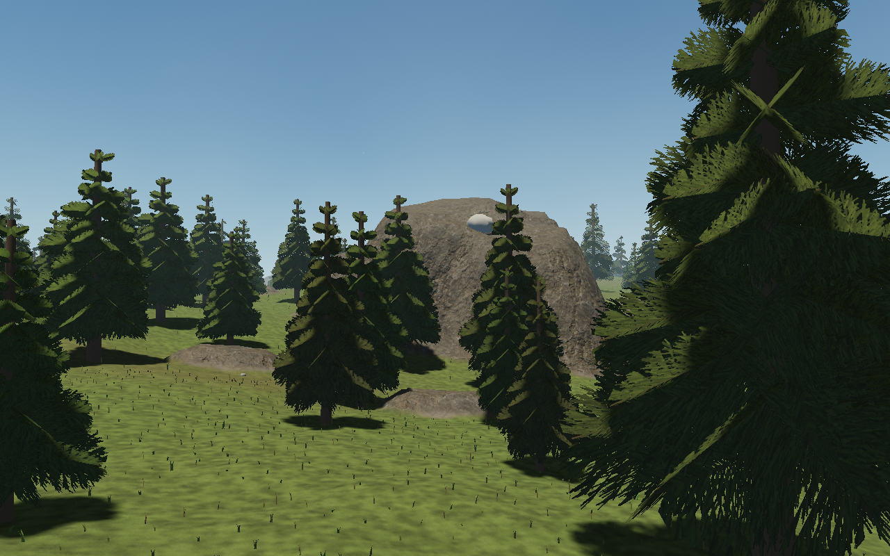
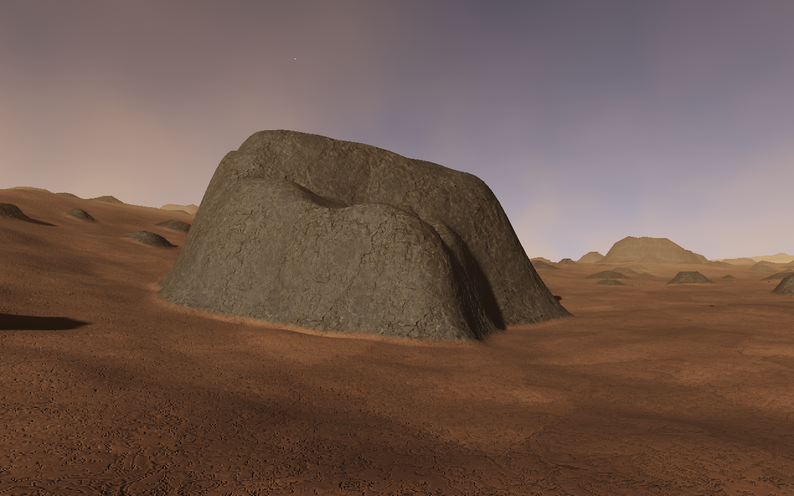
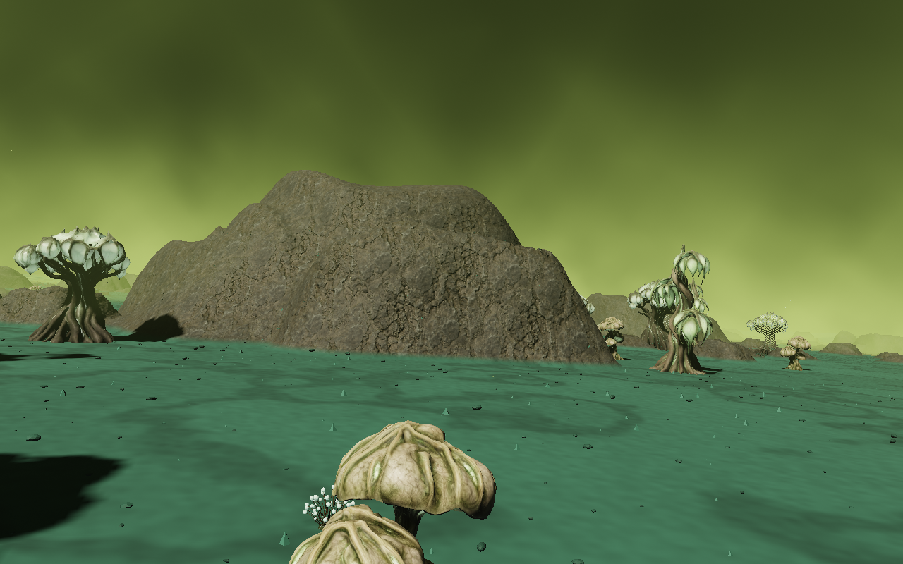
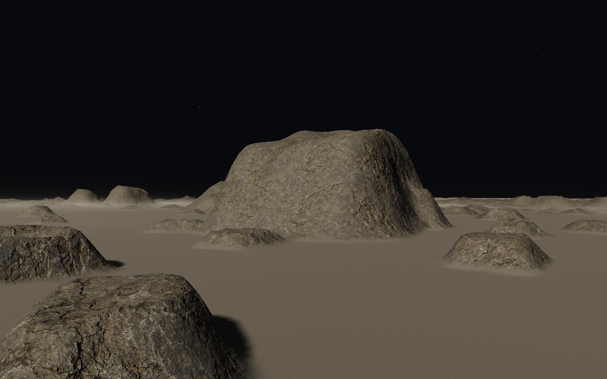

# Surface haze and particles

The existing orbital atmospheres now have a local layer of moving air and dust
near the ground. The effect is on by default and does not change navigation,
gravity, atmospheric flight density, terrain heights, biome seeds or resources.

- Aeon has cool meadow/woodland mist and occasional pollen. Moisture adjusts its
  density; highlands stay clearer and polar regions use low spindrift.
- Pyre has warmer volcanic haze and suspended ash.
- Miasma has sulphur-green ground wisps and drifting toxic-looking motes.
- Selene retains its airless black sky and flight model. A shallow layer of
  lofted dust sits close to the rocks; it is an artistic effect, not a simulation
  of a lunar atmosphere or charged dust physics.

`src/surface-weather.js` composites a 14-step local volume into the existing HDR
atmosphere pass, before tone mapping. Two samples of the existing 3D cloud-noise
texture shape moving billows. Scene depth clips the integration against rocks,
plants and ships, and nearby detail receives less haze than distant silhouettes.
Illumination follows the local sun and darkens on the night side.

A 25×25 cache samples each world's **canonical** terrain, including outcrops.
It places aerosol density above the ground and is never used for geometry or
collision. Samples are concentrated near the player (10.7 m spacing at the
centre, coarser toward the 1.5 km edge), with 64 samples prepared per frame.
Only complete caches are published; the prior cache stays resident while the
next one is sampled. GPU positions and heights are local; body-centre and anchor
subtraction happen first in JavaScript doubles. Noise phases wrap at a shared
65,536 m period to preserve the pattern through origin changes.

768 small point sprites supply nearby pollen, ash or dust. They use logarithmic
depth, depth testing, soft circular edges, and smooth near/distance fades.
The particle field wraps outside its visible radius. It adds one draw call and
no terrain triangles; the volume reuses the existing atmosphere draw. There are
no downloaded textures, dependencies or network services for this pass.

The local volume fades between 650 m and 1.5 km above the canonical ground;
existing planetary scattering/clouds continue above it. Particles disappear
earlier. Station interiors suppress the effect, and a clear zone around the
camera protects cabin views. This is visual atmosphere: no weather damage,
storms, particle collisions, thruster coupling or volumetric self-shadowing.
The height cache approximates small terrain between samples.

## Reproduce and verify

Use `H` → Quick transit → forest/coast or Selene, then descend near the surface.
The existing Miasma and Pyre destinations also retain their normal approaches.
`?weather=0` disables this layer for comparison. With `?debug`,
`window.starAgent.state.surfaceWeather` exposes readiness/profile/strength, and
`window.starAgent.surfaceWeather.enabled` can toggle it without moving the view.

```sh
npm test
npm run build
npm run test:browser -- -c scripts/surface-weather.config.js
```

Unit coverage checks canonical height samples and astronomical-origin precision
on all four worlds and at the poles, airless Selene/stellar exclusions, incremental
cache publication/reuse, shelter and orbit suppression, body changes and disposal.
The browser tour compares identical seeded outcrop views with the effect off/on,
checks actual shader/page errors and then confirms it clears in orbit. Captures
and environment metadata are written to `/tmp/star-agent-weather`.

## Verification — 7 September 2026

All 21 unit-test files pass, and the production build passes with its existing
bundle-size advisory. The refined four-world browser comparison passes in
8.8 minutes with no page or console errors. All surface captures were inspected.
The final cache invalidation guards were additionally tested for same-body
transit and the opposite hemisphere; these do not change the volume shader.
The final production flight/boarding browser regression also passes (2.2
minutes), exercising orbit, terrain streaming, landing, walking, the physical
hatch/ramp, reboarding and launch with the new effect enabled.

Browser: Chromium 151.0.7922.173, ANGLE Vulkan SwiftShader, 1280×800 captures at
render scale 1. This is a software rendering check, not a laptop GPU benchmark;
no hardware frame-time/FPS claim is made. The atmosphere adds fragment work.
Measured draw calls below include the existing scene; its Miasma cost already
exceeds the project target before this effect.

| Surface | Draw calls off → on | Triangles, unchanged |
| --- | ---: | ---: |
| Aeon | 443 → 444 | 1,138,086 |
| Selene | 415 → 416 | 264,962 |
| Pyre | 615 → 616 | 822,274 |
| Miasma | 1,279 → 1,280 | 3,271,860 |






Comparisons: [Miasma before](images/surface-weather/miasma-before.png) /
[after](images/surface-weather/miasma-after.png),
[Selene before](images/surface-weather/selene-before.png) /
[after](images/surface-weather/selene-after.png).
