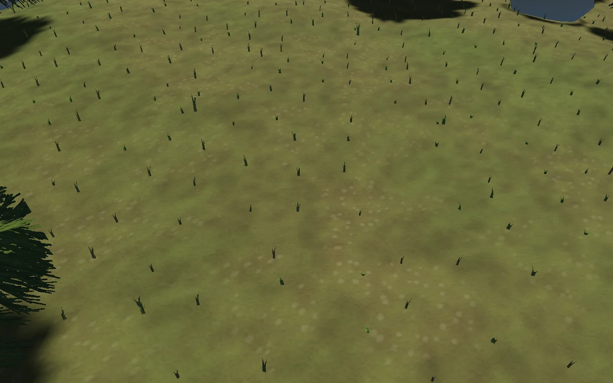
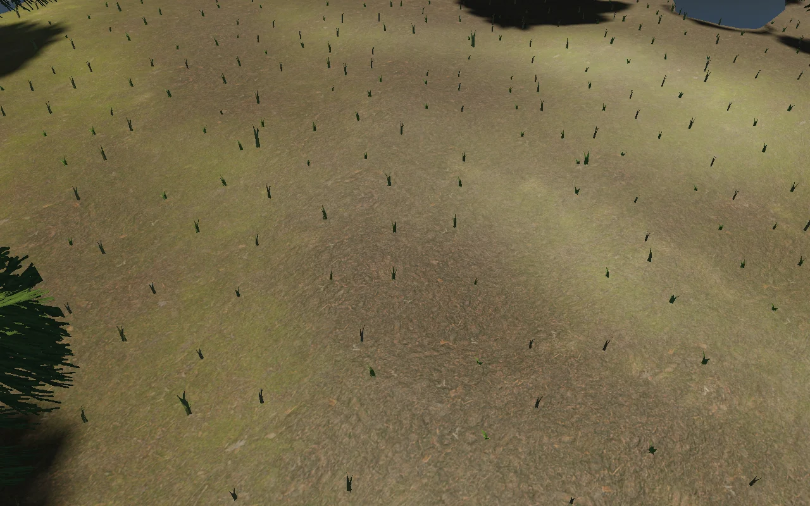
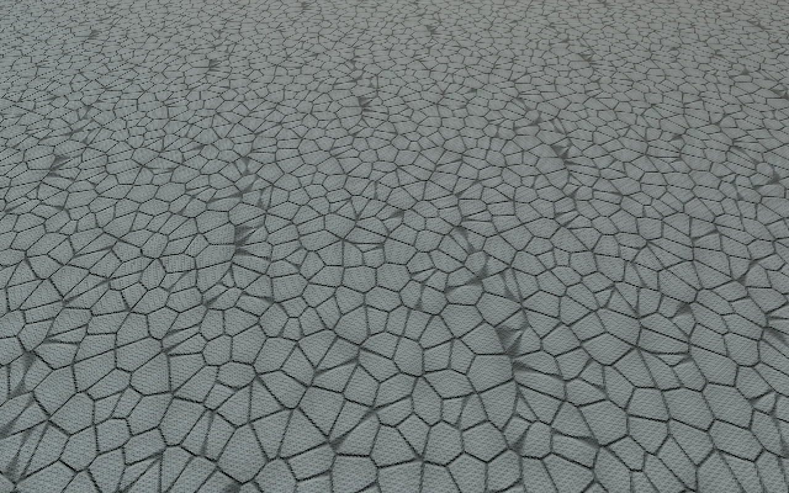
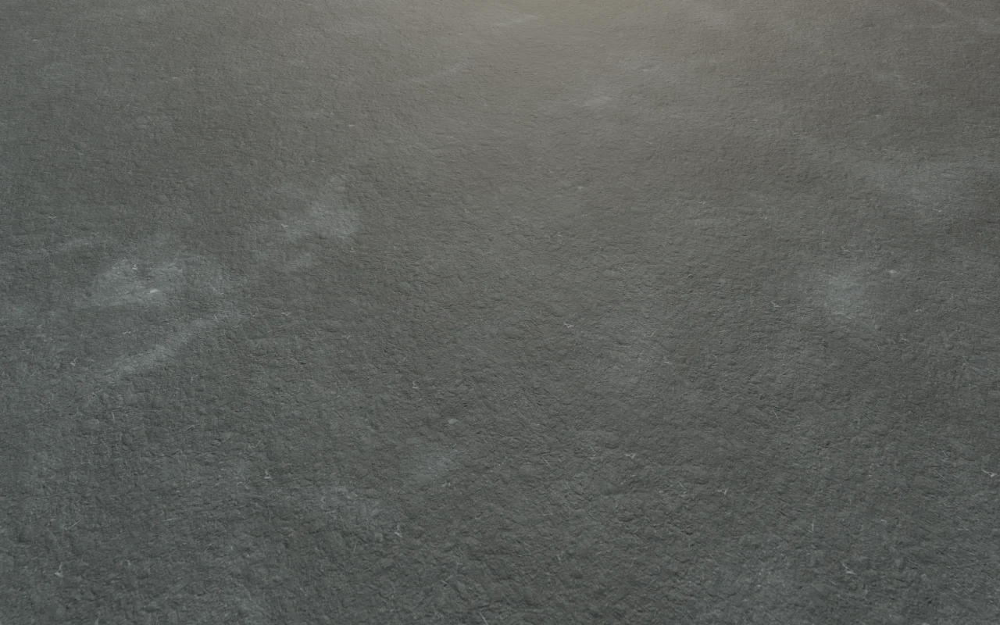
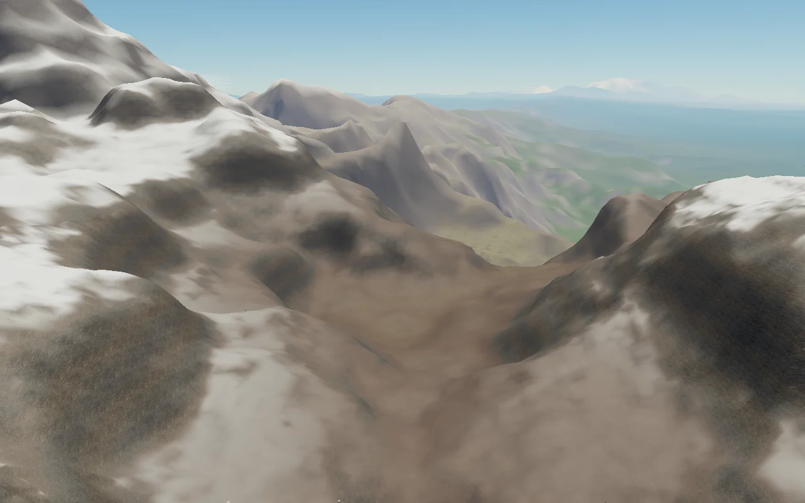
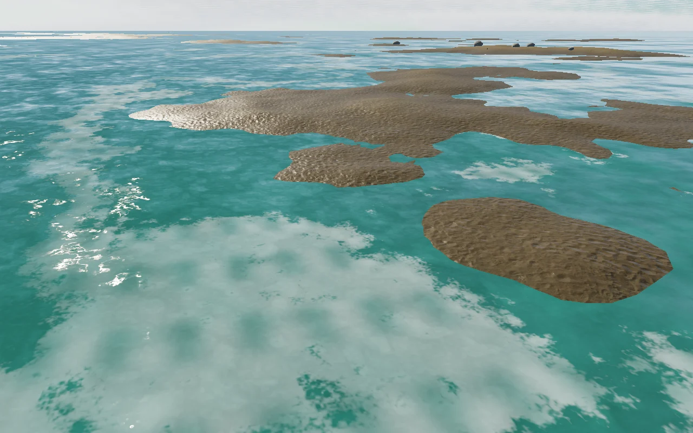
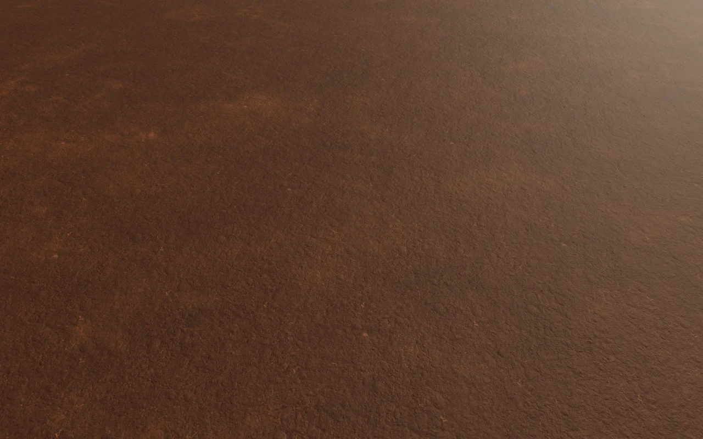
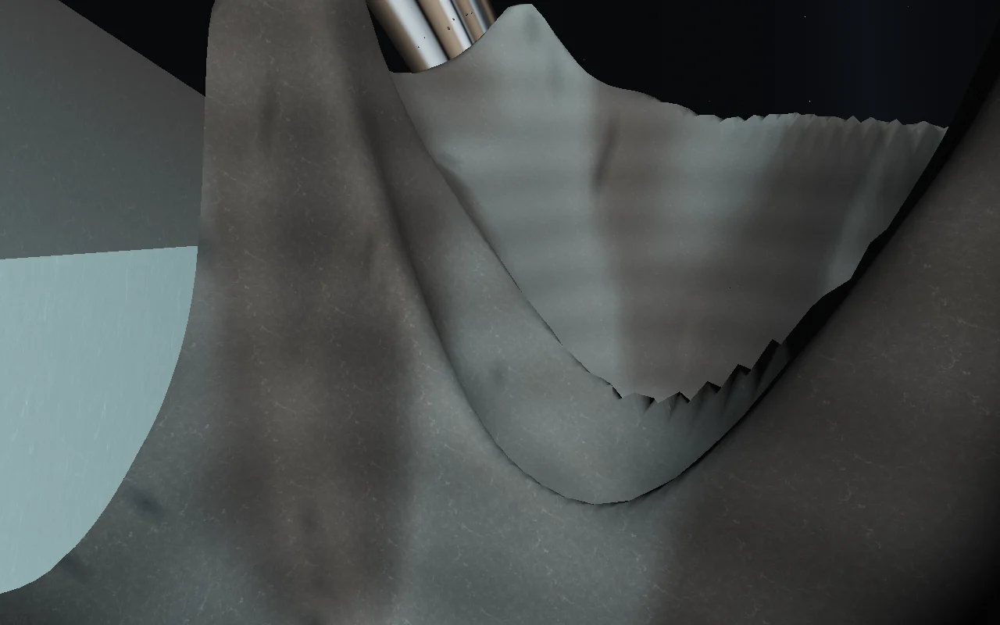

# Aeon and Selene surface materials

Walking and low flight now reveal local soil, moss, sand and cliff textures on
Aeon. Exposed rock interrupts snow on slopes; damp shoreline sand darkens and
has lower roughness. Selene uses granular dust and exposed stone while preserving
the lunar generator's copper deposits, dark basalt and blue ice districts.

This contribution is stacked on `feat/lunar-landscape` (PR #15, `ea7c35b`). Its
craters, mountains, rings and ice effects are existing work from that branch.
This pass changes surface shading, not terrain shape or collision.

## Material sources and cost

Four CC0 ambientCG materials are bundled locally: Ground048 (soil), Rock030
(cliff), Ground037 (moss), Ground054 (sand). Both bodies share two 512×2048 PNG
atlases, uploaded as four-layer arrays. The download totals 4,547,913 bytes; the
two RGBA8 arrays use approximately 10.67 MiB including mipmaps. Existing fallback
textures remain allocated. No package dependency or hosted runtime API was added.

Provenance, archive/output hashes and packing are recorded in
[`manifest.json`](../public/materials/terrain/manifest.json), with licence details
in [`CREDITS.md`](../public/materials/terrain/CREDITS.md).
To rebuild, download the four manifest archives into a directory as `Ground048.zip`,
`Rock030.zip`, `Ground037.zip`, and `Ground054.zip`, then run:

```sh
python3 scripts/pack-terrain-materials.py /path/to/archives
```

The optional preparation tool uses Python's standard library and ImageMagick 7.
The browser only needs the committed atlas files. Albedo uses sRGB sampling;
normal XY and roughness remain linear. Array rows remain unflipped, so the shader
reflects normal Y accordingly. Opaque packing avoids canvas alpha premultiplication
corrupting data. Z is reconstructed before projecting normals onto the true terrain
tangent plane. This provides shading relief without moving the physical floor.

## Integration contracts

- `terrain-maps.js` owns shared, reference-counted textures. It publishes both maps
  together after decoding and dimension checks. Failed loads keep the procedural
  materials, and pending loads cannot resurrect textures after disposal.
- `surface-materials.js` blends Aeon layers using the existing height, biome colour
  and slope attributes. The distant planetary albedo remains in use.
- `moon.js` retains canonical vertex colours and frost masks. Terrestrial soil is
  desaturated for lunar microdetail; it is not measured regolith data.
- Texture periods of 4, 8, 16, 64 and 256 metres divide the existing 256m patch phase.
  Projection is continuous across patch seams and floating-origin changes. No world
  positions are newly converted to GPU floats.
- Terrain parents, skirts, streaming, log depth, atmosphere, vegetation, navigation
  and physical boarding retain their existing code and behaviour.
- Normal detail fades with distance; coarse colour variation continues farther into
  low flight. The lighting inspection page supplies the new material inputs too.

## Review

Preview: <http://localhost:53740/>. Select Forest, Coast or Mountains for Aeon;
select Selene for the lunar landing shelf. L lands, F leaves the chair; open the
rear hatch and walk down the ramp to inspect materials at walking height.

```sh
npm test
npm run test:browser -- -c scripts/terrain-surfaces.config.js
npm run test:browser -- -c scripts/moon.config.js -g 'Selene landing'
```

The material tour captures the actual production renderer at six matched poses,
checks compiled shader link status and published texture uniforms, and separately
checks corrupt-atlas fallback. Original PNGs and detailed render metadata live in
`/tmp/star-agent-terrain-surfaces/`. Curated images below are browser captures, not
concept renders. Numerical invariants and the physical lunar boarding journey are
checked separately.

Verified on 6 September 2026: **77 numerical tests, production build, both material
browser tests and the physical lunar journey pass**. Chromium 151.0.7922.173,
ANGLE/Vulkan SwiftShader, 1280×800. Material captures use render scale 1; streaming
uses .5 and the physical journey uses .55. All five material shader variants linked,
both atlases returned HTTP 200, every checked readiness uniform was 1, and the normal
material tour recorded zero console/page errors. The deliberately corrupt atlas
produced the expected procedural-fallback warning with no browser errors.

The tour checks visible LOD (17 for close lunar ground, 14 for crater flight), not
global cache idleness: lunar background patch rebuilds can continue. Earlier runs
encountered an idle-cache timeout and an interrupted browser channel; the final
dedicated-port run passes. The persistent preview is separately served on 53740.

| Surface | Before | After |
| --- | --- | --- |
| Aeon soil |  |  |
| Selene dust |  |  |

The close comparisons use identical camera poses. Animated particles and streaming
timing can differ. These are surface-shading comparisons, not evidence of geometry
changes. Additional final views:






## Limits

This is the first material pass. Geometry LOD faceting and discrete transitions
are still visible, especially on distant mountains and crater silhouettes. It adds
no fix for the coarse lunar vertex-colour boundaries visible in the crater capture;
the canonical geological masks still interpolate at the current mesh LOD. It adds
no rock scatter, terrain displacement, caves or surface deformation. Normal maps
do not add silhouette detail or cast small geometric shadows. Texture sampling
adds fragment cost; SwiftShader screenshots do not establish hardware FPS.
