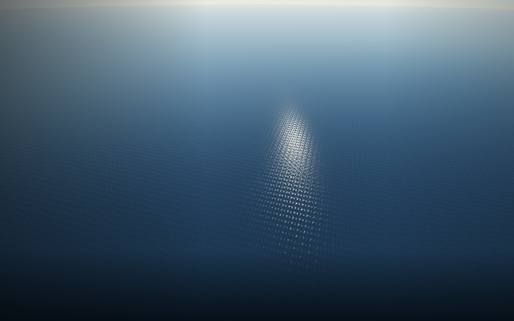
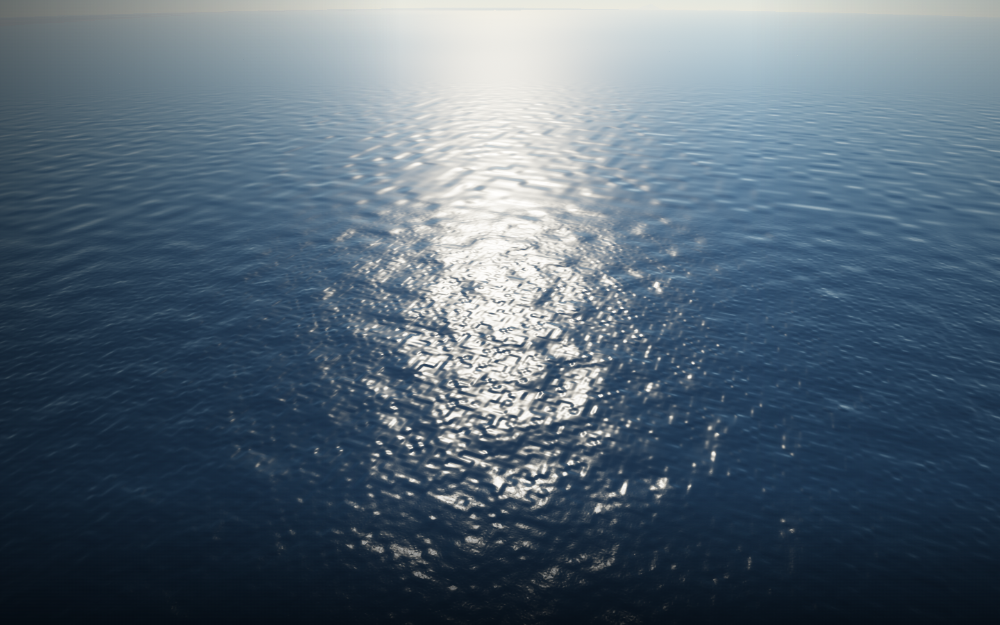
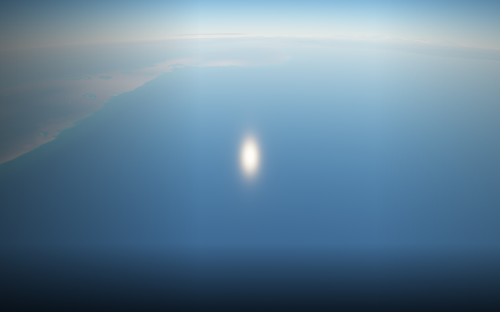
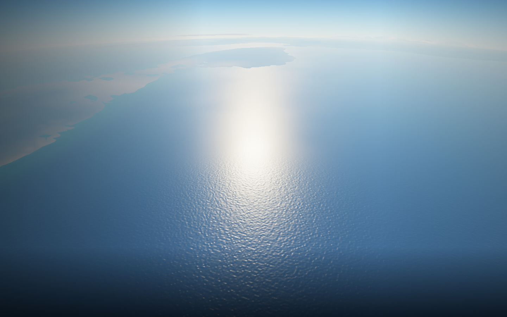

# Ocean rendering at flight altitude

The water uses irregular procedural wave gradients in world space. Fine ripples
blend into a broader sun reflection as their screen footprint shrinks, so the
surface retains roughness while flying higher. Water depth and the shoreline
continue to use the same terrain generator as navigation and collision.

At 2 km, before:

At 2 km, after:

At 20 km, before:

At 20 km, after:

These are application screenshots from matching camera poses over the same
seeded ocean. Wave animation phases differ. Captured at native 1440×900 with
Chromium 151 / ANGLE Vulkan SwiftShader, without UI. They demonstrate appearance,
not hardware performance. Existing terrain silhouette and atmospheric haze remain
visible at high altitude.

Run `npm run test:browser -- -c scripts/water.config.js` for the production ocean
and shoreline tours. It saves 40 m, 300 m, 2 km, 20 km, 100 km, horizon and shallow
shoreline views to `/tmp/star-agent-water-after-*.png` and checks browser errors.
The eight water field unit cases cover deterministic anchors, negative cells,
camera rebasing and CPU/GPU coefficient agreement at distant world coordinates.

This is surface shading: there is no displaced wave mesh, buoyancy, underwater
view or reflection of ships and terrain. These remain future work.
